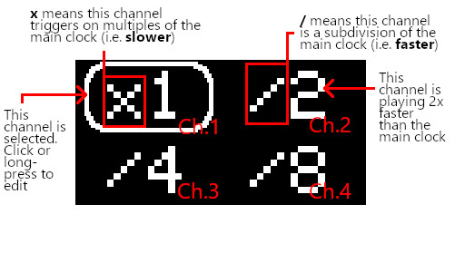

# Clock

A clock module sends rythmic voltage pulses at different subdevisions or multiples of a given tempo. If you want to have any kind a syncronous tempo to your music, use a clock to drive all your other modules and keep them in sync. You can use a clock output to step a sequencer or plug it directly into gate and trigger inputs.

## Manual

**(A) OLDED Screen**

Displays menu with configurable screensaver animation

### (B) Encoder

Navigates the menu. Turn to move up/down. Click to select an item. Long-hold (.5 secconds) to enter or exit a sub-menu.

### (C) Outputs.

8 digital gate output channels (0-5v).

### Menu

Scroll to move between the differnt channels and the global BPM. Click to edit the BPM or clock division. Click again to go back to navigating.

Hold the button down for .5 secconds to get an extended menu for any channel. This menu lets you edit more propperties of the channel. Long press again to get out.

| Property | Abberviation | Details |
|----------|--------------|---------|
| Division | | The clock division sets the frequency of the channel. A value of `xN` will hit on every Nth beat of the refference clock. A value of `/N` will run N times for every cycle of the main clock. If this notation is counterintuitive to you, you can change it in configuration. This value only increments in powers of two in the main menu, but you can set odd values in the details menu.
| Pulse Width | PW | Controls how long the gate will be on. By default, each channel has a pulse width of 50 which means that it will be on for half of each cycle. If you just want a short trigger, lower this value.
| Phase Shift | PS | Controls how in/out of phase the channel is. A value of 0 means that the channel will open its gate on the exact multiple of the master clock. A positive value means it will open a little late, and a negative value will open early. The value is a percentage of *this channel*'s period, so a value of 50 will be fully out of phase or "inverted". This means that two channels with the same PS value but different clock divisions won't be in sync with eachother..
| Swing | SW | Swing is like phase shift but it only effects *every other* cycle of the channel. A channel with swing will be non-uniform. If swing is too high and pulse width isn't reduced the gate opening for the odd beats can run right into the one for the even beats, which might make it look like the clock time was just doubled. Similarly, negative swing can stretch the gate. Negative swing is disabled by default for this reason (enable it in configuration).

## Assembly

See [general assembly instructions](https://github.com/QuinnFreedman/modular/wiki/Assembly).

### Components

See [components page](https://github.com/QuinnFreedman/modular/wiki/Components) for more info.

* 16 Resistors
* 8 Jacks
* 8 LEDs
* 1 I2C 128x64 OLED display
* 1 Rotary encoder
* 1 Arduino Nano

### Orientation

Insert the LEDs with the short legs (cathodes) facing downward when the module is in the case (on the flat side of the circles in the PCB silkscreen).

Position the Arduino with the USB port facing downward (match the square solder pads on the Arduino to the square pad on the PCB).

Put in the screen "upside down" with the pins at the bottom.

Put all the components on the side of each PCB with the sikscreen markings. The copper traces of the two boards should face each other.

### Resistor values

The resistors in this module can be basically any value you want. The vertical resitors (the ones that connect directly to the LEDs) control the brightness of the LEDs. They can be as low as 220 Ohms for a very bright LED to 10k for a very dim one. The best value might depend on the LEDs you have. I used a value of 470Ohm in my prototype which was pretty retina melting with the 3mm LEDs I had but good for some generic 5mm LEDs I tried.

The horizontal LEDs control the output imedance. This just makes it so that if the output ever gets shorted to ground (by another module or when plugging in a cable), the Arduino doesn't get fried. Again, I used 470Ohm in my prototype, which worked fine. I think 200Ohms would be absolutely maxing the Arduino's current if all 8 outputs were similtaneously on and grounded, and you could probably go as high as 10k at least without issue. Here, a low value would just waste power while a very high value might give a slightly less precise output or eventually might not be detected by some modules, depending on their design. I would probably recommend a slightly higher value, maybe 1k or 10k.

## Extra features

There are a lot of configurable options at the top of `Clock.ino`. Edit it with Arduino IDE. They should be self-explanitory based on their comments.

In addition there are a couple features that the hardware and software supports that I couln't find room for in the PCB or faceplate. You could put them in an expander module or put them instead of something else.

These features must be enabled in configuration.

### Pause button

Connecting pin D6 on the Arduino to GROUND will pause or un-pause the clock. Attatch a momentary push button to the output for D6 and attatch the other end to GROUND.

When the module is paused, D7 will be set HIGH (5v). You can use this to turn on an LED, a CV gate output, or both. If you prefer, you can configre it to be HIGH when the module is **not** paused. In either case, make sure to add a resistor to the output.

### Sync (follow mode) input and/or tap tempo

When you connect the D8 pin to 5v multiple times, the clock's tempo will be set to the durration between those triggers. This can be used to make a tap-tempo button and/or an input to follow an external clock (or both!).

In both cases, you will need to tie D8 to GROUND via a pulldown resistor (~10k).

#### Follow mode

If you are attatcing an external input to the module, you will need some mechanism to ensure that the voltage never goes outside of 0-5v. A transistor or opto-isolator (vactrol) should work.

#### Tap tempo

If you are just implementing a tap tempo button and don't want to solder on a pulldown resistor, you can set the pin mode of D8 ot `INPUT_PULLUP` in `setup()` in Clock.ino. Then, use a button to connect the pin to GROUND instead.

## Requirements

Arduino IDE 1.8.10 

|Library                | Author   | Version |
|-----------------------|----------|---------|
| [Adafruit SSD1306][1] | Adafruit | 2.2.0   |
| [Adafruit GFX][2]     | Adafruit | 1.7.5   |

[1]: https://github.com/adafruit/Adafruit_SSD1306
[2]: https://github.com/adafruit/Adafruit-GFX-Library
