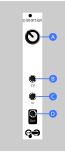

# Diode Distortion
Super simple analog voltage-controlled distortion.

## Manual

This module distorts audio by soft-clipping it using a pair of diodes. It can also be used to smoothly clip control voltages if you build it without AC-coupling.

* **A** - Distortion amount
* **B** - CV input. Summed with Distortion knob position but may be non-linear.
* **C** - Signal input
* **D** - Signal output

## Assembly

### Components

See [components page](https://github.com/QuinnFreedman/modular/wiki/Components) for more info.

| Reference | Part          | Value     | Comment |
|-----------|---------------|-----------|--|
| R1-R3     | Resistor      | 100kΩ     |  |
| R4-R7     | Resistor      | 10kΩ      |  |
| R8,R9     | Resistor      | 1kΩ       |  |
| C1        | 1uF           | Capacitor | Part of the AC-coupling. A lower value is also fine if that's all you have. |
| C2,C3     | 100pF         | Capacitor | Stabalizing capacitor for amps. **Optional** |
| C4,C5     | 10uF          | Capacitor | Power filtering capacitors. **Optional** |
| C6        | 100nF         | Capacitor | Power filtering capacitor. **Optional** |
| D1,D2     | Diode         | 1n4148    | Any diode with forward voltave <1v would probably work here, although the effect might be different. |
| U1        | Op-amp        | TL074     |  |
| U2        | Opto-isolator | NSL-32    | This allows the control voltage to modify the distortion. If you don't have this exact part, any vactrol should be fine here. Or, you can make one by taping an LED to a light-dependent resistor. If you don't care about CV, you can also just leave this out. |
| J1-J3     | Jack socket   | PJ301M-12 |  |
| J4        | Pin header    | 2x5       |  |

### Instructions

See [general assembly instructions](https://github.com/QuinnFreedman/modular/wiki/Assembly).

#### AC-coupling 

The default design is AC-coupled, meaning it will ignore any constant offset voltage in an audio signal. But, it means it's not suitable for manipulating CV signals. If you want to use this module to clip CV signals (or if you want to be able to deliberately tweak it by adding an ofset to your audio) just **leave out R1 and replace C1 with a bit of wire**.

#### CV control

If you don't care about CV control, this module can be even simpler. Just leave out R9, R2, U3, and J3.

#### Schematic

