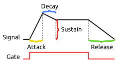
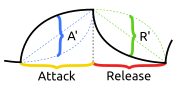

# Envelope

A simple but powerful envelope generator with 4 modes. Can be used as a linear ADSR or exponential AD, looping or not.

# Manual

### (A) Mode Select Button

This button lets you cycle between the four modes. While pressing the button, the LEDs will illuminate to indicate which mode is selected.

### (B) LEDs

While selecting modes, the LEDs will show the active mode:
1. **(yellow)** ADSR mode
2. **(blue)** AARR mode
3. **(red)** AARR Loop mode
4. **(green)** TRAP mode

Once a mode is selected, the LEDs will show which phase the envelope is in. At any given time, the LEDs are illuminated corrosponding to the knobs/inputs that control the current phase in the current mode.

### (C) Knobs & CV input

There are 4 knobs, each with CV control from 0-5v. They control different parameters of the envelope. Their function changes based on the mode of operation. See the diagrams below for more. They are colored (1) Yellow, (2) Blue, (3) Red, (4) Green.

| Knob       | ADSR            | AARR            | AARR Loop       | TRAP Loop       |
| ---------- | --------------- | --------------- | --------------- | --------------- |
| (1) Yellow | Attack time     | Attack time     | Attack time     | Attack time     |
| (2) Blue   | Decay time      | Attack rate     | Attack rate     | Sustain *time*  |
| (3) Red    | Sustain *value* | Release time    | Release time    | Release time    |
| (4) Green  | Release time    | Release rate    | Release rate    | Delay time      |

### (D) Gate [input]

In a non-looping mode, the gate is the the main way you interact with the envelope. When the gate is HIGH, the envelope will start to open up and will stay open (high) until the gate is set LOW. If the gate is only triggered breifly, the attack can be interupted so the envelope may never open fully.

In a looping mode, by default, the gate will stop the envelope looping as long as it is HIGH. The firmware can also be configured to *only* loop while the gate is high instead.

### (E) Ping (aka retrigger) [input]

This is a trigger input. When it recieves a trigger, it will cause the envelope to open. If the gate is closed, sending a trigger will just cause the envelope to fully open and then close again. If the gate is on, sending a trigger to ping will keep the envelope open, but will "re-trigger" it. For example, if the envelope was in a Sustain phase, re-trigger will briefly set the envelope back to 100% and then it will decay back to the Sustain level.

### (F) Out [output]

The main output. Outputs analog values between 0-5v.

### (G) Inv [output]

Outputs an inverted version of the main out, but transposed to also be between 0-5v. I.e. INV will he HIGH when OUT is LOW and LOW when OUT is HIGH. This is useful for sidechaining and other ducking.

# Modes

## ADSR mode

    

ADSR is a "standard" linear envelope mode with attack, decay, sustain, and release controlled by the 4 inputs, respectively.

## AARR mode

    

AARR (or A,A',R,R') mode gives up control of the decay and sustain. Instead, knobs (2) and (4) are used to control the exponential rate of the attack & release. These controls can go through zero, so both attack and decay can be either exponential or logarithmic.

## AARR Loop mode

    

AARR Loop is exactly like AARR mode except that it loops continuously. It goes back and forth between Attack and Release (no sustain), so it is always rising or falling.

## TRAP Loop mode

    

This mode could be called ASRD for Attack/Sustain/Release/Delay, but I call it TRAP for "trapezoid" to remove confusion. This mode is another looping mode where you can control how long the envelope stays HIGH and LOW between Attack/Decay in the loop. This lets you create a pulse-width modulated square wave or saw wave, or any other simple waveform.

# Assembly

### Components

See [components page](https://github.com/QuinnFreedman/modular/wiki/Components) for more info.

#### Front PCB

| Reference | Part | Value | Comment |
| --------- | ---- | ----- | ------- |
| R1-R8 | Resistor | 100kΩ | |
| RV1-RV4 | Potentiometer | B10kΩ | Other values would probably be fine here. |
| D1-D4 | LED | | |
| J1-J8 | Jack socket | PJ301M-12 | |
| S1 | Button | | You can use any panel-mount OFF-(ON) style push button here as long as it fits. There is breakaway section of the PCB to make room for the button. The two pins of the button will need to be soldered two the two holes marked "S1" via a bit of insulated wire. It does not matter which lead of the button connects to which hole as long as the button will connect the two points together when pressed. |
| J9-J10 | Pin headers | | Male/female pin headers to connect the front and back PCB boards |

#### Back PCB

| Reference | Part | Value | Comment |
| --------- | ---- | ----- | ------- |
| R1-R8 | Resistor | 100kΩ | |
| R9,R10 | Resistor | 1kΩ | Controls output impedance |
| R11-R14 | Resistor | 10kΩ | |
| R15 | Resistor | 470Ω | Goes with the voltage reference shunt. A different value might be more optimal and/or power efficient |
| Q1,Q2 | NPN Transistor | 2N3904 | |
| U1 | Op-amp | MCP6004 | |
| U2 | DAC | MCP4922 | |
| U3 | Shunt voltage ref | LM4040LP-5 | |
| C1-C4 | Capacitor | 10nF | **(Optional)** Help potentially reduce noise & feedback in input CV circuitry |
| C5 | Capacitor | 100nF | Goes with the voltage reference shunt |
| C6 | Capacitor | 100nF | **(Optional)** Bypass capacitor to reduce noise in the power supply |
| C7 | Capacitor | 10nF | **(Optional)** Bypass capacitor to reduce noise in the power supply |
| J9-J10 | Pin headers | | Male/female pin headers to connect the front and back PCB boards |
| J1 | Pin headers | | 2x8 shrouded male Eurorack power connector |

### Instructions

See [general assembly instructions](https://github.com/QuinnFreedman/modular/wiki/Assembly).

### Customization & Hidden Features

There are a lot of configurable options in the `config.h` file. Edit them before uploading the firmware to chenge the behavior of the module. There are also two unused pins on the Arduino (A4 and A5) which can be set to perform other functions like end-of-rise and end-of-fall triggers if you want to make an expander or add some more inputs to the faceplate.

#### `ANALOG_READ_MAX_VALUE` and `ANALOG_READ_MIN_VALUE`

When the Arduino reads an analog value, it will get a number between 0 and 1024. However, the potentiometers might not go all the way from exactly 0 volts to exactly 5 volts. If you want to be able to totally max out a parameter (like setting the sustain at actually 100%) you can set these parameters to adjust what range the Arduino will expect. For example, if you set `ANALOG_READ_MIN_VALUE = 15`, then any raw value &le;15 will be considdered 0 volts.

#### `ATTACK_MAX_DURATION_MICROS`, `ATTACK_MIN_DURATION_MICROS`, etc...

When detecting a maximum or minimum voltage (as given by the parameters above), these parameters dictate what value that should corrospond to in the envelope.

By default, all of the times can be turned down all the way to zero, which means that the envelope will skip that segment entirely. But, this means that if you set all the knobs to zero the envelope will skip every stage and essentially not work. Setting the minimum values to even just 1 microseccond will force the envelope to actually run through that stage as fast as it can, which will probably get you the fastest LFO. Or, set it to a higher minimum if you always want a little slew in your envelope.

#### `EXP_RATE_SCALE`

How extreme the max log/exp curve is. Default: 4 Must be &gt; 0. The formula for the exponential curve is given by:

Where `t` is time, `k` is knob position, and `r` is `EXP_RATE_SCALE`.

#### `LOOP_WHEN_GATE_OFF`

If `true`, then the looping modes will loop when the GATE input is LOW and will pause/not loop when the GATE is HIGH. If `false`, the opposite is ture. Looping on GATE HIGH probably makes more sense in a vacuum, but GATE is normalled LOW (for the non-looping modes) which makes looping on HIGH inconvenient.

#### `LOOP_HARD_SYNC_ON_PING`

If `true`, recieving a "ping"/"retrigger" pulse while in a looping mode will cause a hard sync (i.e. go back to the beginning of the loop). If `false`, this trigger will cause the LFO to go smoothly into attack mode.

### AUX Pins

There are two unused pins on the arduino (A4 and A5) that can be configured to perform a number of features.

#### EOR and EOF triggers

If these modes are enabled, the Arduino will send short triggers to the two aux pins at the end of the rise and fall of the envelope. EOR will always trigger right after the attack phase ends (or would end if attack time is zero). EOF will trigger at the end of the release. in ADSR mode, if sustain is zero, then this means that EOF will trigger when the gate is turned off, which might be after the envelope has gone to zero.

#### Gate passthrough (`GATE_PASSTHROUGH_ENABLED true`)

When enabled, the aux pin will be triggered as long as the input gate is HIGH. This is output after the gate signal has been processed by the computer, so it may be a few milisecconds delayed from the GATE input and is pretty much a totally separate circuit. This can be useful for an LED indicator.

#### LED mode indicator (`LED_MODE_INDICATOR_ENABLED true`)

When enabled, the aux win will be held HIGH whenever the LEDs are displaying the mode (instead of the phase). This could be used to add an indicator LED or light-up button if it is confusing what state the display is in.
