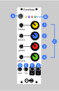
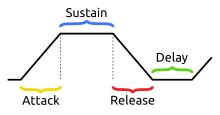

# Envelope

A simple but powerful envelope generator with 4 modes. Can be used as a linear ADSR or exponential AD, looping or not.

# Manual

### (A) Mode Select Button

This button lets you cycle between the four modes. While pressing the button, the LEDs will illuminate to indicate which mode is selected.

### (B) LEDs

While selecting modes, the LEDs will show the active mode:
1. **(yellow)** ADSR mode
2. **(blue)** AARR mode
3. **(red)** AARR Loop mode
4. **(green)** TRAP mode

Once a mode is selected, the LEDs will show which phase the envelope is in:
1. **(yellow)** Attack
2. **(blue)** Decay
3. **(red)** Sustain
4. **(green)** Relase

### (C) Knobs & CV input

There are 4 knobs, each with CV control from 0-5v. They control different parameters of the envelope. Their function changes based on the mode of operation. See the diagrams below for more. They are colored (1) Yellow, (2) Blue, (3) Red, (4) Green.

| Knob       | ADSR            | AARR            | AARR Loop       | TRAP Loop       |
| ---------- | --------------- | --------------- | --------------- | --------------- |
| (1) Yellow | Attack time     | Attack time     | Attack time     | Attack time     |
| (2) Blue   | Decay time      | Attack rate     | Attack rate     | Sustain *time*  |
| (3) Red    | Sustain *value* | Release time    | Release time    | Release time    |
| (4) Green  | Release time    | Release rate    | Release rate    | Delay time      |

### (D) Gate [input]

In a non-looping mode, the gate is the the main way you interact with the envelope. When the gate is HIGH, the envelope will start to open up and will stay open (high) until the gate is set LOW. If the gate is only triggered breifly, the attack can be interupted so the envelope may never open fully.

In a looping mode, by default, the gate will stop the envelope looping as long as it is HIGH. The firmware can also be configured to *only* loop while the gate is high instead.

### (E) Ping (aka retrigger) [input]

This is a trigger input. When it recieves a trigger, it will cause the envelope to open. If the gate is closed, sending a trigger will just cause the envelope to fully open and then close again. If the gate is on, sending a trigger to ping will keep the envelope open, but will "re-trigger" it. For example, if the envelope was in a Sustain phase, re-trigger will briefly set the envelope back to 100% and then it will decay back to the Sustain level.

### (F) Out [output]

The main output. Outputs analog values between 0-5v.

### (G) Inv [output]

Outputs an inverted version of the main out, but transposed to also be between 0-5v. I.e. INV will he HIGH when OUT is LOW and LOW when OUT is HIGH. This is useful for sidechaining and other ducking.

# Modes

## ADSR mode

    

ADSR is a "standard" linear envelope mode with attack, decay, sustain, and release controlled by the 4 inputs, respectively.

## AARR mode

    

AARR (or A,A',D,D') mode gives up control of the decay and sustain. Instead, knobs (2) and (4) are used to control the exponential rate of the attack & decay. These controls can go through zero, so both attack and decay can be either exponential or logarithmic.

## AARR Loop mode

AARR Loop is exactly like AARR mode except that it loops continuously. It goes back and forth between Attack and Release (no sustain), so it is always rising or falling.

## TRAP Loop mode

    

This mode could be called ASRD for Attack/Sustain/Release/Delay, but I call it TRAP for "trapezoid" to remove confusion. This mode is another looping mode where you can control how long the envelope stays HIGH and LOW between Attack/Decay in the loop. This lets you create a pulse-width modulated square wave or saw wave, or any other simple waveform.

# Assembly

### Components

See [components page](https://github.com/QuinnFreedman/modular/wiki/Components) for more info.

* Resistors
  * 2x 100kohm
  * 2x 200kohm
  * 4x 66.5ohm
  * 4x 10kohm
  * 2x 2kohm (should match potentiometers -- so if you are using B50k potentiometers use 10k resistors here)
  * 2x 1kohm (controls output impedance)
  * 4x 220ohm (controls LED brightness -- I would actually reccomend something more like 680 for dimmer LEDs)
* 4 Potentiometers (B10k)
* 8 Jacks
* 4 LEDs
* 1 Button (momentary switch -- SPST)
* 2 NPN transistors
* 1 MCP4922 (DAC)
* 1 MCP6004 (Op-Amp)
* 2 10uF capacitors (optional)
* 1 100nf capacitor (optional)
* m/f stacking headers and 1 2x8 shrouded header.
* a few inches of insulated wire

### Instructions

See [general assembly instructions](https://github.com/QuinnFreedman/modular/wiki/Assembly).

#### Mounting the button

Most of the buttons I have found are not pcb-mounted so I have left a hole in the front PCB for the button to poke through.

Mount the button in the faceplate and then solder wires from the two terminals of the button into the two holes labelled "Switch" in the front PCB.  In my experience, this button can be the most unreliable part of the module, so make sure the solder joints are insulated and try to ground the housing of the button if it is metal.

When I had my PCBs printed from pcbway.com, they didn't actually cut out the button hole. If this happens to you, you will need to drill or cut out a hole big enough for the button to fit through (or just find a very short button or mount it higher). You can cut up to the solder protection but not into it -- there are traces right up to the edge of the hole.

#### Soldering the bottom jacks

I keep all my PCBs to be less than 10cm tall. This makes them much cheeper to print, but it means that this design doesn't quite fit on the board. The bottom row of jacks hang off the edge a little bit. If you don't mind paying extra, you can just extend the PCB 5mm in Fritzing. Otherwise, you will need to solder a wire to the bottom pin of these 4 jacks.

The wire is a ground so it can be a bare wire. Solder it to the bottom-most (shank) pins of all for jacks and then to the hole marked GND. If your PCB manufacturer has left solder pads for the middle (switch) pins, you can solder those to the board for stability. Otherwise, leave them hanging. They are not used in this module.

As always, I reccomend screwing the jacks into the faceplate before soldering to hold them in place.
