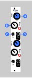

# Offset/Attenuvert

O/A is a small, analog utility module to manipulate the magnitude and level of a CV signal. For example, if you had an LFO going between (-5v - +5v), you could manipulate it to be between (+5v and +7v).

There are two identical halves, each with an offset knob and an attenvert knob.

### (A) Offset

Offset adds or subtracts an amount from the signal, from -10v to +10v.

For a CV signal, this will control the level of the signal.

For an audio signal, this will likely have no effect unless you push it far enough to clip at the edge of Eurorack's +/-10v range. In some cases, you could add a small amount to an audio signal to change how it is processed by an effect, like a wavefolder.

### (B) Attenuvert

Attenubert is a mix of attenuate and invert. All the way right, the signal is passed through unaffected. At 12 o'clock, the signal is completely muted. All the way to the left, the signal is output at full volume but inverted.

### (C) Input

Audio or CV input

### (D) Input

Outputs the attenverted signal. LED indicates the level of the output signal.

## Assembly

### Components

See [components page](https://github.com/QuinnFreedman/modular/wiki/Components) for more info.

* Resistors
  * 10x 10kohm (or any value as long as they all match -- 1k is fine)
  * 2x 1kohm (controls output impedance)
  * 2x 470ohm (controls LED brightness -- I would actually reccomend something more like 1k-1.4k for dimmer LEDs)
* 4 Potentiometers (any value)
* 4 Jacks
* 2 Bi-directional LEDs (or regular LEDs if you can't find any)
* 1 TL074
* 2 10uF capacitors (optional)
* 1 100nf capacitor (optional)
* m/f stacking headers and 1 2x5 shrouded header.
    * You can also use a 2x8 shrouded header and cut off the top 6 pins.
* small standoff screws (optional)

### Instructions

See [general assembly instructions](https://github.com/QuinnFreedman/modular/wiki/Assembly).

The 100nf capacitor is meant to go on the back side of the panel, on the opposite side of the TL074.

Bidirectional or bipolar LEDs will show a different color when the output is negative or positive. If you put in regualr LEDs, they will only light up when the output is positive.

The stacking headers are only one one side of the module, so for stability you might want to use some small standoff screws to connect the other side of the two PCBs together. Their height should be approximately equal to the height of the stacking headers. There are a few hols in the PCB for this. Make sure that the screws don't touch the metal of the potentiometers or anthing else conductive. You could use plastic washers or bend some of the potentometer housings to avoid this, or only use one or two of the holes.
