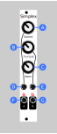
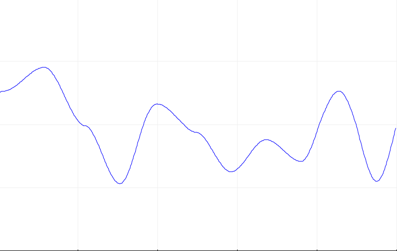

# Simplex

Simplex generates two channels of smooth random voltage based on the simplex noise* algorithm. Simplex noise produces values that are alway in motion but never change abruptly and never repeat. It's great for adding some subtle, organic parameter moodulation to your patch or for generating random melodies and arpeggios.

## Manual

### (A) Speed

Controls how quickly both channels move through time. This is like the frequency on an LFO except that the output will never repeat. A higher speed value means that the noise will varry more sharply.

### (B) Texture

Controls how "smooth" or "rough" the noise is for both channels. Texture works by adding more layers of noise with higher frequency and lower amplitude -- essentailly like overtones or harmonics in audio. If you just want "basic" smooth noise, put texture all the way to the left. If you want to have some large fluctuations over a very slow time scale while still having some quick organic jitter on top, move it towards the right. Here is a graph of output values with texture low (left) and high (right).

|Simplex noise with texture off | Simplex noise with texture high |
|-------------------------------|---------------------------------|
| | 

### (C) Amplitude

Attenuates the range of output channel A. (Channel B is fixed).

### (D) Speed CV [input]

CV control for speed (both channels). 0-5v. Input is added to the speed potentiomeer value, capped at 5v.

### (E) Texture CV [input]

CV control for texture (both channels). 0-5v. Input is added to the texture potentiomeer value, capped at 5v.

### (F) & (G) Outputs

There are two output channels. Both channels will have the same speed and texture, but will be completely separate from each other.

* **A**: Channel A. -10v - +10v, attenuated by **Amplitude (C)**
* **B**: Channel B. 0-5v

## LFO Mode

This same hardware can be loaded with different firmware to function as a dual LFO. To do so, just open `config.h` and replace the line `#define FIRMWARE_MODE FIRMWARE_MODE_SIMPLEX` with `#define FIRMWARE_MODE FIRMWARE_MODE_LFO`. In LFO mode, the module has two very simple independently rate-controlled triangle LFOs. They DO NOT tract V/Oct and don't have many fancy features like tempo sync, etc. If there is a demand, I might add some of those features. For now, it's a great way to get some extra functionality out of this PCB if you had to buy multiples.

In LFO mode, the controls are as follows:

### (A) Speed A

Control of the speed of the left channel (channel A)

### (B) Speed B

Control of the speed of the right channel (channel B)

### (C) Amplitude

By default, this attenuates the range of output channel A. (Channel B is fixed). If you prefer, this can be configured to control the waveform of channel A instead. See `config.h` for configuration options.

### (D) & (E) Speed CV [input]

CV control for speed for both channels. 0-5v. Input is added to the respective speed potentiomeer value, capped at 5v. These are linear and do not track v/oct.

### (F) & (G) Outputs

There are two triangle LFO output channels, **A**, and **B**. 

* **A**: Channel A. -10v - +10v, attenuated by **Amplitude (C)**
* **B**: Channel B. 0-5v

## Assembly

### Components

See [components page](https://github.com/QuinnFreedman/modular/wiki/Components) for more info.

#### Front PCB

| Reference | Part           | Value      | Comment |
|-----------|----------------|------------|--|
| R1,R2     | Resistor       | 1kΩ        |  |
| R3,R4     | Resistor       | 5.1kΩ      | Control LED brightness. Higher values makes the lights dimmer |
| RV1-RV3   | Potentiometer  | 50kΩ linear| Value does not matter. Any value is fine here |
| D1,D2     | LED            | 3mm        |  |
| J1-J4     | Jack           | PJ301M-12  |  |
| J5-J6     | Stacking pin headers | 1x7, 1x3 |  |

#### Front PCB

| Reference | Part           | Value      | Comment |
|-----------|----------------|------------|--|
| R1-R5     | Resistor       | 10kΩ       | The value doesn't relaly matter as long as they are all the same |
| U1        | Op-amp         | TL072      |  |
| U2        | Op-amp         | MCP6002    |  |
| U3        | DAC            | MCP4922    |  |
| A1        | Arduino Nano   | v3.0       |  |

### Instructions

See [general assembly instructions](https://github.com/QuinnFreedman/modular/wiki/Assembly).

The capacitors are intended to remove noise from the power supply. But, with my power supply, I was not able to even measure a difference. You can just leave them out if you want, or put in multiple capacitors of different values in parallel if you want to experement.

The long jumper wire in the PCB design is to connect the signal to the left LED. If you want the 2 LEDs to be identical, connect it with a wire as shown in the Fritzing PCB view, from J1 to J3. If you want to use a bipolar LED for the left channel (so it will be a different color when the output is negative), instead connect the bottom jumper wire terminal with the top of the 1k resistor right next to it (J2 to J3). You will probably also want to replace the adjacent 220Ohm resistor with something approx 2x larger since the voltage will be [-10v,+10v] instead of [0,+5v].

The stacking headers that hold the 3 layers together are not evenly spaced. You may want to additionally use some standoffs in provided the holes to keep the panels from coming apart when you push on them. Make sure the standoffs aren't too tall or they could separate the headers so the don't make a good contact.

## Requirements

Arduino IDE 1.8.10 

|Library                | Author   | Version |
|-----------------------|----------|---------|
| [SPI][1]              | Arduino  |         |

[1]: https://www.arduino.cc/en/reference/SPI
