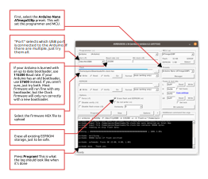

# Assembly

The general assembly process is more or less the same for all modules:

1. Acquire PCBs/Faceplate
    - Download the GERBER files from each module's page
    - Upload the files to a PCB manufacturer like JLCPCB
    - **OR** buy boards from my [Etsy shop](https://www.etsy.com/shop/freemodular/)
2. Acquire components
    - Download the Tayda bill of materials CSV from each module's page
    - Upload them to [Tayda quick order](https://www.taydaelectronics.com/quick-order/)
    - Get any parts Tayda doesn't carry from [Mouser](https://www.mouser.com/) or [DigiKey](https://www.digikey.com/)
    - **OR** buy complete kits from my [Etsy shop](https://www.etsy.com/shop/freemodular/)
4. **Solder** everything together
    - See the notes in each module's bill of materials for specific instructions for some components
5. **Flash** the firmware onto the Arduino by USB (if applicable)

 Specific information for each module can found in the documentation for that module.

## What you will need

For information about the components you will need and where to get them, see the [components](https://quinnfreedman.github.io/modular/docs/components) page. Module-specific components may also be listed in the module's documentation.

In addition to the electrical components required for the module, you will need a soldering iron and some solder. It may also be useful to have a multimeter to check your work and a solder wick to fix your mistakes.

## Soldering

All the components of the module will be held together with solder. If you have never soldered before, don't worry! It's very easy and you will learn quickly. There are numerous videos on YouTube showing you how to do it. At first, your solder joints might look a little ugly but they should still work fine and it is very unlikely that you will damage any components in the process.

Make sure that your space is well ventilated (or use a fume extractor) and make sure to wash your hands and table afterward if you are using led solder.

## PCB

I highly recommend using printed circuit boards to make these modules. Each module has links to GERBER files which describe the PCB layout. Upload these to a manufacturing service like [PCBWay](https://www.pcbway.com/) or [JLCPCB](https://jlcpcb.com/order) to get them printed. 

Most modules are built out of a sandwich of two PCBs, so you will need to print them both.

When filling out an order, you can leave all the settings default. These PCBs do not require any special features or materials. I also try to keep all my PCBs under 100mmx100mm, which means you should get a super cheap flat rate with most manufacturers.

Some manufacturers require files in slightly different formats. GERBERs for JLCPCB and PCBWay are pre-generated for each board. If you want to use another service, try the PCBWay files. If that doesn't work, open the source files in KiCad and re-export the files you need following your manufacturers instructions.

If you want to make the modules on stripboard, a schematic PDF for each module should be linked in the module's documentation, but you will need to do the stripboard layout yourself.

## Faceplate

There is an SVG image file linked in each module's documentation with my design for the faceplate. You can print this out and use it as a stencil for marking and drilling a sheet of aluminum. If you print a stencil, make sure that it is 128.5mm tall. If not, that is an indication that the scale was messed up in the printing.

Alternatively, you can use the same service that you used for the PCBs to print a faceplate. Each module also has GERBER files for the faceplate, which can be printed as if it was a PCB. JLCPCB also offers aluminum-backed PCBs, which I highly recommend for this.

## Assembly

Each module should have a file with assembly instructions and materials. Read the comments for module-specific instructions. Additionally, each PCB has an interactive BOM, linked in the module docs, which helps you keep track of which components you need to place and where they go.

Other than that, there is no special trick to this. Put each component into the PCB in the location indicated by the silkscreen, and then solder them in place. It's general recommend to start will the smallest pieces (like resistors) and work up to the tallest components (like potentiometers). This makes it easier to lay the board flat on its back for soldering. Before soldering any panel components (like jacks, potentiometers, and switches) I recommend assembling the whole module and screwing them firmly onto the faceplate in order to make sure everything is properly aligned.

I use single row pin headers to attach boards to each other in a way that is removable. When soldering these, it is best to assemble both sides together before soldering so that you can make sure they line up. This will also help hold the headers in place. Similarly, when you solder on the headers that will hold the Arduino, it is easiest to put the Arduino in them and then solder them on as one unit.

## Checking for errors

If you want to check your module for errors before plugging it in for the first time, you can use a multimeter. Set the meter to continuity or resistance mode and touch the probes to each combination of the power pins (ground, +5v, -12v and +12v). None of these pins should be shorted to each other. Also, none of the audio/CV inputs/outputs should be shorted directly to ground (or power) when a cable is plugged in (although some of them may be connected to ground through a resistor, and some may be "normalled" to ground when a cable is disconnected). Plug in a cable to each jack and check for shorts between the shank of the cable (aka the collar or ring) and the tip, or between the tip and the power pins.

## Firmware

If the project you are assembling involves an Arduino, then you will need to load the right program onto that Arduino in order for the module to work.

Each module's documentation should link to a HEX file. That file is the program that needs to be uploaded to the Arduino. There are multiple ways to do that and none of them are as user friendly as I would like. Until I find a better tool, I recommend using [avrdudess](https://github.com/ZakKemble/AVRDUDESS). If you are on Windows, you can download the latest release from the [releases page](https://github.com/ZakKemble/AVRDUDESS/releases) and it should just work. If you are on Mac or Linux, refer to the documentation.

If your Arduino does not show up when you plug it in, you may need to [install a driver](https://learn.sparkfun.com/tutorials/how-to-install-ch340-drivers/all) (some 3rd-party clone boards use a different USB chip).

Note that most firmware will work on any Arduino Nano, but if a module's firmware uses all of the available space (like the Clock firmware), then it will only work properly with an Arduino running the newer Arduino bootloader. If your Arduino is running the old bootloader, you will need to burn a new one. This is a little more involved than uploading firmware and requires a second Arduino (of any type) to use as a programmer. See [this article](https://support.arduino.cc/hc/en-us/articles/4841602539164-Burn-the-bootloader-on-UNO-Mega-and-classic-Nano-using-another-Arduino) for detailed instructions. If your Arduino isn't working for any reason or seems bricked, re-burning the bootloader will often fix whatever is going on.
