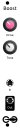

<h1>Boost</h1>

A distorting, overdriving analog amplifier. Can be used to boost line-level or microphone signals with gentle overdrive, or to heavily distort Eurorack audio. Boost gives up to 26dB of gain, diode clipping, and active tone control to shape the flavor of the distortion.

<h2>Resources</h2>

<ul>
  <li><a href="https://quinnfreedman.github.io/fm-artifacts/Boost/boost_manual.pdf">Manual</a></li>
  <li><a href="https://quinnfreedman.github.io/modular/modules/Boost/docs/assembly_instructions">Assembly instructions and BOM</a></li>
  <li><a href="https://quinnfreedman.github.io/fm-artifacts/Boost/boost_pcb_interactive_bom.html">Interactive BOM</a></li>
  <li><a href="https://quinnfreedman.github.io/fm-artifacts/Boost/boost_faceplate.svg">Faceplate stencil SVG</a></li>
  <li>GERBER files:
    <ul>
      <li>Faceplate: <a href="https://quinnfreedman.github.io/fm-artifacts/Boost/boost_faceplate_jlcpcb.zip">JLCPCB</a>, <a href="https://quinnfreedman.github.io/fm-artifacts/Boost/boost_faceplate_pcbway.zip">PCBway</a></li>
      <li>PCB: <a href="https://quinnfreedman.github.io/fm-artifacts/Boost/boost_jlcpcb.zip">JLCPCB</a>, <a href="https://quinnfreedman.github.io/fm-artifacts/Boost/boost_pcbway.zip">PCBway</a></li>
    </ul>
  </li>
  <li>Parts on Tayda <a href="https://www.taydaelectronics.com/savecartpro/index/savenewquote/qid/19841852897">cart link</a>, <a href="https://freemodular.org/modules/Boost/fm_boost_tayda_bom.csv">quick-order CSV</a></li>
  <li><a href="https://github.com/QuinnFreedman/modular/tree/main/modules/Boost">Source files</a></li>
  <li><a href="https://quinnfreedman.github.io/fm-artifacts/Boost/boost_schematic.pdf">Schematic PDF</a></li>
</ul>

<b>DIY difficulty:</b> Very easy 
<b>HP:</b> 4 
<b>Power usage:</b> not tested yet (but probably quite low)

