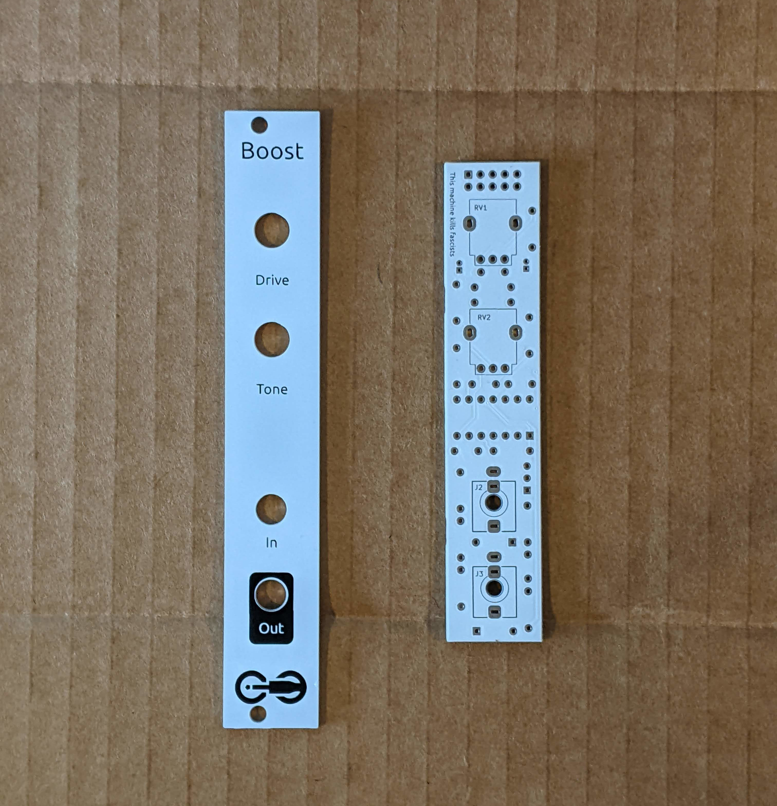
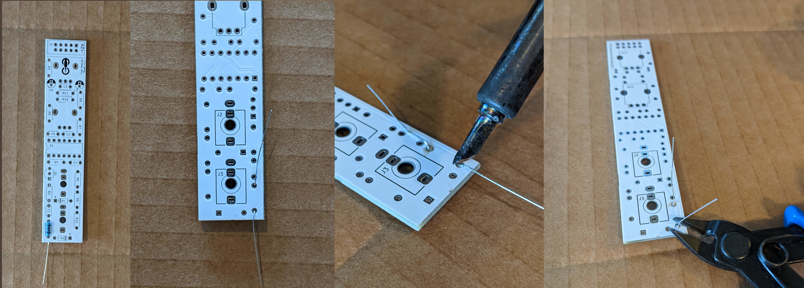
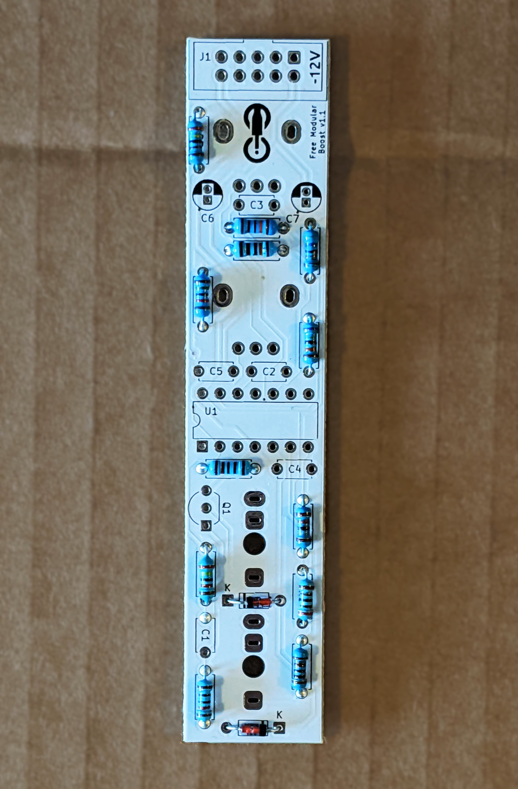
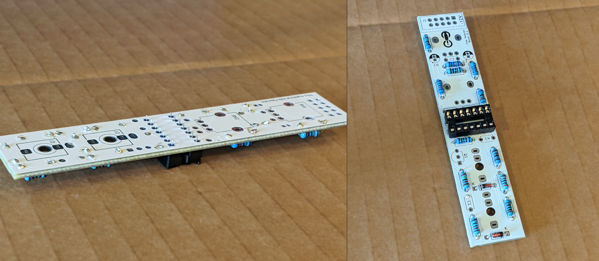
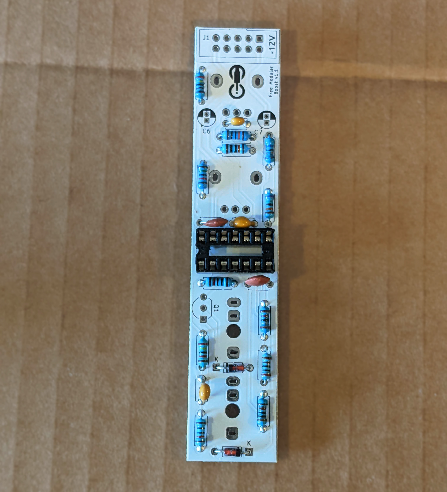
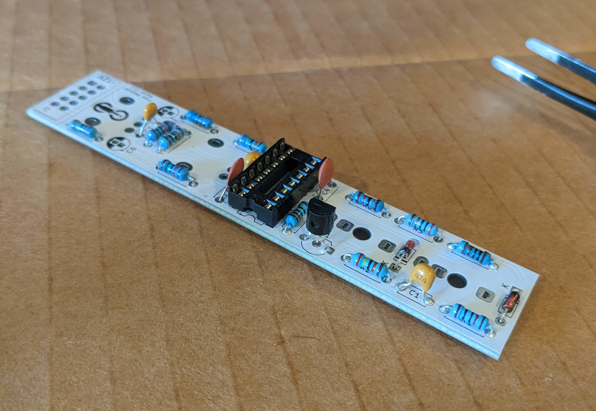
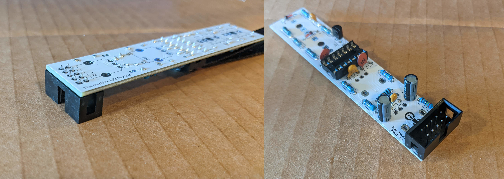
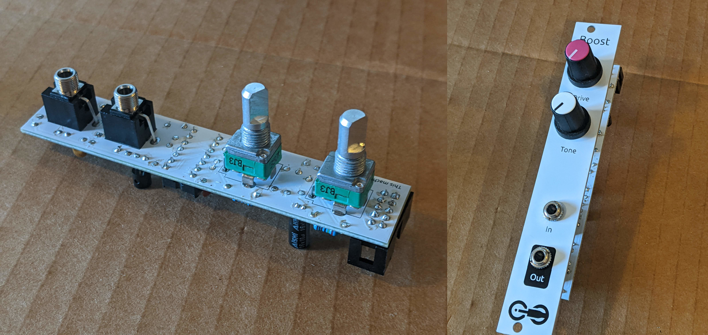
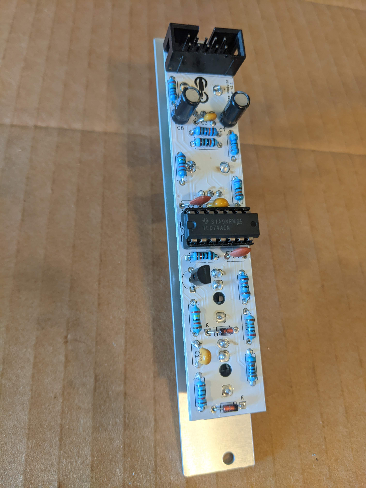

# Boost Assembly Instructions

## Components

Parts are available on Tayda ([cart link](https://www.taydaelectronics.com/savecartpro/index/savenewquote/qid/19841852897), [quick-order CSV](https://freemodular.org/modules/Boost/fm_boost_tayda_bom.csv)).

See [general components notes](https://quinnfreedman.github.io/modular/docs/components) for more info about acquiring parts.

[Interactive BOM](https://quinnfreedman.github.io/fm-artifacts/Boost/boost_pcb_interactive_bom.html)

| Reference | Part             | Value                                   | Source  | Comment |
| --------- | ---------------- | --------------------------------------- | ------- | ------- |
| R1, R4    | Resistor         | 10kΩ                                    | [Tayda](https://www.taydaelectronics.com/resistors/1-4w-metal-film-resistors/10-x-resistor-10k-ohm-1-4w-1-metal-film-pkg-of-10.html) | R4 controls the current flowing through the clipping diodes. Using a different value would give a slightly different tone, especially if you want to use different diodes.  |
| R2        | Resistor         | 24kΩ                                    | [Tayda](https://www.taydaelectronics.com/resistors/1-4w-metal-film-resistors/10-x-resistor-24k-ohm-1-4w-1-metal-film-pkg-of-10.html) | Should be 1/2 the resistance of RV1. If you want more gain, you can make it smaller, but you may encounter op-amp clipping. |
| R3        | Resistor         | 2.4kΩ                                   | [Tayda](https://www.taydaelectronics.com/resistors/1-4w-metal-film-resistors/resistor-2-4k-ohm-1-4w-1-metal-film-pkg-of-10.html) | Should be 1/10x R2. |
| R5        | Resistor         | 2kΩ                                     | [Tayda](https://www.taydaelectronics.com/resistors/1-4w-metal-film-resistors/resistor-2k-ohm-1-4w-1-metal-film-pkg-of-10.html) | |
| R6        | Resistor         | 18kΩ                                    | [Tayda](https://www.taydaelectronics.com/resistors/1-4w-metal-film-resistors/resistor-18k-ohm-1-4w-1-metal-film-pkg-of-10.html) | |
| R7        | Resistor         | 750kΩ                                   | [Tayda](https://www.taydaelectronics.com/resistors/1-4w-metal-film-resistors/resistor-750k-ohm-1-4w-1-metal-film-pkg-of-10.html) | |
| R8        | Resistor         | 560kΩ                                   | [Tayda](https://www.taydaelectronics.com/resistors/1-4w-metal-film-resistors/resistor-560k-ohm-1-4w-1-metal-film-pkg-of-10.html) | |
| R9        | Resistor         | 15kΩ                                    | [Tayda](https://www.taydaelectronics.com/resistors/1-4w-metal-film-resistors/resistor-750k-ohm-1-4w-1-metal-film-pkg-of-10.html) | This resistor sets the cutoff frequency for the high-shelf filter which determines which frequencies are boosted/cut by the Tone knob. Feel free to adjust the value or swap it out for a trim pot to dial it in by ear. Just don't turn it all the way down to a short. |
| R10, R11  | Resistor         | 100kΩ                                   | [Tayda](https://www.taydaelectronics.com/resistors/1-4w-metal-film-resistors/10-x-resistor-100k-ohm-1-4w-1-metal-film-pkg-of-10.html) | |
| R12       | Resistor         | 1kΩ                                     | [Tayda](https://www.taydaelectronics.com/resistors/1-4w-metal-film-resistors/10-x-resistor-1k-ohm-1-4w-1-metal-film-pkg-of-10.html) | |
| RV1, RV2  | Potentiometer    | B50kΩ                                   | [Tayda](https://www.taydaelectronics.com/potentiometer-variable-resistors/rotary-potentiometer/50k-ohm-linear-taper-potentiometer-d-shaft-pcb-9mm.html) | You can use another value if you have it available. Any value is fine for RV1 as long as you adjust R2 and R3 relative to RV1. Any value for RV2 is probably fine, but it might slightly change the response curve. Lower is probably better. I chose linear pots, but you could use an exponential pot for RV1 if you prefer, since it is setting an audio gain. |
| J1        | IDC connector    | 2x6                                     | [Tayda](https://www.taydaelectronics.com/10-pin-box-header-connector-2-54mm.html) | Eurorack power header. Can use two rows of male pin headers or a shrouded connector (recommended). |
| J2, J3    | 3.5mm Jack       | THONKICONN (a.k.a PJ398SM or PJ301M-12) | [Tayda](https://www.taydaelectronics.com/pj-3001f-3-5-mm-mono-phone-jack.html) | |
| D1, D2    | Diode            | 1N4148                                  | [Tayda](https://www.taydaelectronics.com/1n4148-switching-signal-diode.html) | You can use any diodes or LEDs here. Different diodes will have different response curves and will sound different. You may want to adjust R4 and/or the gain amount of the gain stages (see schematic) to get the diode in its non-linear operating range. You will probably also want to need to adjust the post-clipping gain to get the signal back to Eurorack levels. |
| Q1        | Transistor       | 2N3904                                  | [Tayda](https://www.taydaelectronics.com/2n3904-npn-general-propose-transistor.html) | |
| C1        | Capacitor        | 470nF                                   | [Tayda](https://www.taydaelectronics.com/capacitors/monolithic-ceramic-capacitor/0-47-uf-50v-multilayer-monolithic-ceramic-capacitor-multicomp.html) | This provides the AC coupling for the input stage. Replacing this with a short circuit will add a slight DC offset before clipping and allow you to add more by biasing the input, which will enable asymmetric clipping and maybe a richer, more interesting sound. But it may play less well with outboard gear or unipolar signals. |
| C2        | Capacitor        | 10nF                                    | [Tayda](https://www.taydaelectronics.com/capacitors/ceramic-disc-capacitors/10-x-0-01uf-50v-ceramic-disc-capacitor-pkg-of-10.html) | |
| C3        | Capacitor        | 33pF                                    | [Tayda](https://www.taydaelectronics.com/capacitors/ceramic-disc-capacitors/10-x-33pf-50v-ceramic-disc-capacitor-pkg-of-10.html) | |
| C4, C5    | Capacitor        | 100nF                                   | [Tayda](https://www.taydaelectronics.com/capacitors/ceramic-disc-capacitors/a-553-0-1uf-50v-ceramic-disc-capacitor-pkg-of-10.html) | |
| C6-C7     | Capacitor        | 10uF                                    | [Tayda](https://www.taydaelectronics.com/10uf-16v-85c-radial-electrolytic-capacitor.html) | **Optional.** Power supply noise filtering capacitors |
| U1        | Op-amp           | TL074                                   | [Tayda](https://www.taydaelectronics.com/tl074-quad-operational-amplifier-j-fet-pdip-14-tl074cn.html) | When the boost is turned all the way up and the tone control is also boosting high frequencies, you can get some op-amp clipping on this module. The TL074 doesn't clip the way you might expect -- it will give a very harsh asymmetrical wave-wrapping effect when the voltage is pushed high enough. You could replace this with any rail-to-rail capable op-amp, but I chose to keep the TL074 because I like having a super harsh sound when you turn it all the way up. The cheaper TL084 would probably also be fine here. |

## Build Guide

See [general assembly instructions](https://quinnfreedman.github.io/modular/docs/assembly)

This module only has one PCB. It should be a very fast build.

Start with the resistors. Bend the resistor legs back to hold them in place while you solder, then snip off the extra wire.

Repeat for all resistors. See bill of materials or the [interactive BOM](https://quinnfreedman.github.io/fm-artifacts/Boost/boost_pcb_interactive_bom.html) for which resistor goes where.

Add the diodes as well. The black line on the diode should align with the hole labelled "k".

Add IC socket. Flip the board over and ballance it on the socket, then solder. If you don't have a socket, you can solder the chip directly to the board instead.

Add all the ceramic capacitors in the same way as the resistors.

Add transistor. If you don't care about having a high-impedance input, you can omit the transistor. Instead, use a cutoff leg from one of the resistors to bridge pins 1 and 2 (the square pad and the middle hole). If you do, leave off R1 as well.

Add power header. Flip the board over and support the opposite end so it lays flat, then solder in the header. Add the large capacitors in the same way.

Add the jack sockets and potentiometers. Screw them tightly into the faceplate and make sure everything lines up squarely before soldering.

Lastly, put the op-amp IC into its socket. You may need to straighten the legs a little first to get it to fit. Make sure it is seated firmly.

Optionally, use a multimeter in continuity mode to check for short circuits. Probe the power connector and confirm that there is no continuity between +12V and GND, -12V and GND, or +12V and -12V.

Then you're good to go! Plug it into your rack and start boosting!
