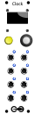

<h1>Clock</h1>

A basic, 8-channel clock source with adjustable tempo, phase shift, pulse width, and swing.

If you want to do virtually anything with rhythm in your modular rack, you will need a clock source to keep all your modules in sync. This module sends out triggers on each of its 8 channels that are all different subdivisions of the same tempo. Use them to trigger samples, ping envelopes, step sequencers, or whatever else you want to happen on beat.

<h2>Resources</h2>

<ul>
  <li><a href="https://quinnfreedman.github.io/fm-artifacts/Clock/clock_manual.pdf">Manual</a></li>
  <li><a href="https://quinnfreedman.github.io/modular/modules/Clock/docs/assembly_instructions">Assembly instructions and BOM</a></li>
  <li>Interactive BOM: <a href="https://quinnfreedman.github.io/fm-artifacts/Clock/clock_front_pcb_interactive_bom.html">front panel</a>, <a href="https://quinnfreedman.github.io/fm-artifacts/Clock/clock_back_pcb_interactive_bom.html">back panel</a></li>
  <li><a href="https://quinnfreedman.github.io/fm-artifacts/Clock/clock_faceplate.svg">Faceplate stencil SVG</a></li>
  <li>GERBER files:
    <ul>
      <li>Faceplate: <a href="https://quinnfreedman.github.io/fm-artifacts/Clock/clock_faceplate_pcb_jlcpcb.zip">JLCPCB</a>, <a href="https://quinnfreedman.github.io/fm-artifacts/Clock/clock_faceplate_pcb_pcbway.zip">PCBway</a></li>
      <li>Front panel: <a href="https://quinnfreedman.github.io/fm-artifacts/Clock/clock_front_pcb_jlcpcb.zip">JLCPCB</a>, <a href="https://quinnfreedman.github.io/fm-artifacts/Clock/clock_front_pcb_pcbway.zip">PCBway</a></li>
      <li>Back panel: <a href="https://quinnfreedman.github.io/fm-artifacts/Clock/clock_back_pcb_jlcpcb.zip">JLCPCB</a>, <a href="https://quinnfreedman.github.io/fm-artifacts/Clock/clock_back_pcb_pcbway.zip">PCBway</a></li>
    </ul>
  </li>
  <li>(Most) parts on Tayda: <a href="https://www.taydaelectronics.com/savecartpro/index/savenewquote/qid/82040858402">cart link</a>, <a href="https://freemodular.org/modules/Clock/fm_clock_tayda_bom.csv">quick-order CSV</a></li>
  <li><a href="https://quinnfreedman.github.io/fm-artifacts/Clock/fm-clock.hex">Firmware HEX</a></li>
  <li><a href="https://github.com/QuinnFreedman/modular/tree/main/modules/Clock">Source code</a></li>
  <li>Schematic: <a href="https://quinnfreedman.github.io/fm-artifacts/Clock/clock_front_pcb_schematic.pdf">front panel</a>, <a href="https://quinnfreedman.github.io/fm-artifacts/Clock/clock_back_pcb_schematic.pdf">back panel</a></li>
</ul>

<b>HP:</b> 8 
<b>Power usage:</b>
<table>
  <tr>
    <th></th>
    <th>Typical</th>
    <th>Maximum (typical connections)</th>
    <th>Theoretical maximum (all outputs shorted to ground)</th>
  </tr>
  <tr>
    <td>+5V</td>
    <td>25mA</td>
    <td>45mA</td>
    <td>85mA</td>
  </tr>
  <tr>
    <td>+12V</td>
    <td>NC</td>
    <td>-</td>
    <td>-</td>
  </tr>
  <tr>
    <td>+12V</td>
    <td>NC</td>
    <td>-</td>
    <td>-</td>
  </tr>
</table>

