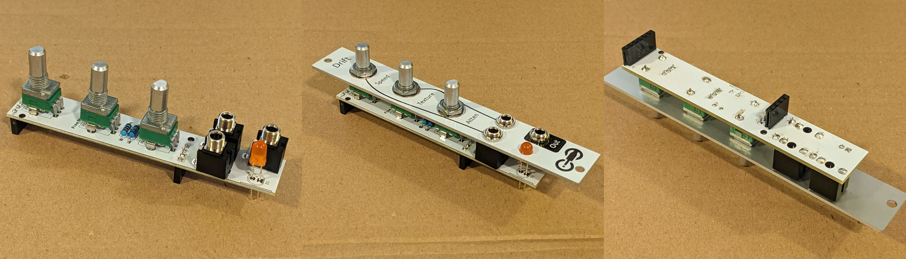
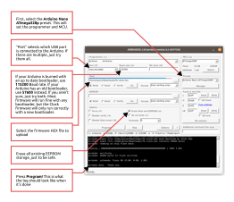

# Drift Assembly Instructions

## Components

**Most** parts are available on Tayda ([quick-order CSV](https://freemodular.org/modules/Drift/fm_drift_tayda_bom.csv)).

See [general components notes](https://quinnfreedman.github.io/modular/docs/components) for more info about acquiring parts.

Interactive BOM: [front](https://quinnfreedman.github.io/fm-artifacts/Drift/drift_pcb_front_interactive_bom.html), [back](https://quinnfreedman.github.io/fm-artifacts/Drift/drift_pcb_back_interactive_bom.html)

|    | Board | Reference | Part             | Value                                   | Source  | Comment |
| -- | ----- | --------- | ---------------- | --------------------------------------- | ------- | ------- |
|    | Back  | R1        | Resistor         | 1kΩ                                     | [Tayda](https://www.taydaelectronics.com/10-x-resistor-1k-ohm-1-4w-1-metal-film-pkg-of-10.html) | Determines output impedance. Any value is fine. |
|    | Back  | R2-R4     | Resistor         | 24kΩ                                    | [Tayda](https://www.taydaelectronics.com/resistors/1-4w-metal-film-resistors/10-x-resistor-24k-ohm-1-4w-1-metal-film-pkg-of-10.html) | R4 should be 1/2 RV3. |
|    | Back  | R5        | Resistor         | 1kΩ                                     |         | Controls LED brightness. |
|    | Back  | R6, R7    | Resistor         | 100kΩ                                   | [Tayda](https://www.taydaelectronics.com/resistors/1-4w-metal-film-resistors/10-x-resistor-100k-ohm-1-4w-1-metal-film-pkg-of-10.html) | |
|    | Back  | C1-C4     | Capacitor        | 100nF                                   | [Tayda](https://www.taydaelectronics.com/capacitors/ceramic-disc-capacitors/a-553-0-1uf-50v-ceramic-disc-capacitor-pkg-of-10.html) | Power filtering and decoupling |
|    | Back  | C5-C7     | Capacitor        | 10uF                                    | [Tayda](https://www.taydaelectronics.com/10uf-16v-85c-radial-electrolytic-capacitor.html) | Power supply noise filtering capacitor |
|    | Back  | C8        | Capacitor        | 4.7nF                                   | [Tayda](https://www.taydaelectronics.com/capacitors/ceramic-disc-capacitors/a-553-0-1uf-50v-ceramic-disc-capacitor-pkg-of-10.html) | **Optional:** This capacitor creates a 1.25kHz lowpass filter with R3 which is applied to the output to smooth out the relatively slow digital sample rate of this module. You can try different values for a smoother signal or leave this out entirely if you don't mind some high-frequency artifacts. |
|    | Front | D1        | LED              | 5mm diffuse orange                      | [Tayda](https://www.taydaelectronics.com/leds/round-leds/5mm-leds/led-5mm-yellow.html) | Any standard 5mm LED will work here. |
|    | Front | J1-J3     | 3.5mm Jack       | THONKICONN (a.k.a PJ398SM or PJ301M-12) | [Tayda](https://www.taydaelectronics.com/pj-3001f-3-5-mm-mono-phone-jack.html) | |
|    | Both  | J4-J7     | Pin headers      | 1x4, 1x6                                | Tayda ([Male](https://www.taydaelectronics.com/40-pin-2-54-mm-single-row-pin-header-strip.html), [Female](https://www.taydaelectronics.com/40-pin-2-54-mm-single-row-female-pin-header.html)), [Amazon](https://www.amazon.com/gp/product/B074HVBTZ4) | Solder the two boards directly together using the male headers or make them detachable using a male/female pair. |
| 🔴 | Both  | -         | Mounting screw   | M2                                      | [McMaster-Carr](https://www.mcmaster.com/products/screws/socket-head-screws~/system-of-measurement~metric/thread-size~m2/) | **Optional:** add an M2 screw or standoff to hold the two PCBs firmly together. |
|    | Back  | J9        | IDC connector    | 2x8                                     | [Tayda](https://www.taydaelectronics.com/16-pin-box-header-connector-2-54mm.html) | Eurorack power header. Can use two rows of male pin headers or a shrouded connector (recommended). |
|    | Front | RV1-RV3   | Potentiometer    | B50kΩ                                   | [Tayda](https://www.taydaelectronics.com/potentiometer-variable-resistors/rotary-potentiometer/linear/50k-ohm-linear-taper-potentiometer-d-shaft-pcb-9mm.html) | Any value is fine. Just match R4 accordingly. |
|    | Back  | A1        | Arduino Nano     | v3.0                                    | [Tayda](https://www.taydaelectronics.com/type-c-nano-3-0-controller-compatible-with-arduino-nano.html) | |
| 🔴 | Back  | U1        | DAC              | MCP4922-E/P                             | [DigiKey](https://www.digikey.com/en/products/detail/microchip-technology/MCP4922-E-P/716251), [Mouser](https://mou.sr/4cwtePf) | |
|    | Back  | U2        | Op-amp           | TL072                                   | [Tayda](https://www.taydaelectronics.com/tl072-low-noise-j-fet-dual-op-amp-ic.html) | TL082 is probably fine too |
|    | Back  | U3        | Op-amp           | MCP6002                                 | [Tayda](https://www.taydaelectronics.com/mcp6002-single-supply-cmos-ic.html), [Mouser](https://mou.sr/4cwtePf) | |
|    | Back  | SW1       | DIP switches     | 1x2                                     | [Tayda](https://www.taydaelectronics.com/black-dip-switch-2-positions-gold-plated-contacts-top-actuated.html) | **Optional:** configuration switches to select noise algorithm. Leave unconnected for the default Perlin noise. You can solder a wire to bridge pairs 1 and/or 2 to select a different mode, or use pair of switches if you want to be able to change it later. See the manual for how to select algorithms. |

🔴 = Missing from Tayda BOM

## Build Guide

Once you have gathered all the components and the PCBs, I reccomend you start with the resistors on the rear PCB.

Bend the resistor legs back to hold them in place while you solder, then snip off the extra wire. Repeat for all resistors. 

Next, add the sockets for the IC chips. If you don't have sockets, you can solder the chips directly to the PCB, but then you won't be able to move or swap them later if there is an error.

Optionally, add the DIP switch to be able to select differnt modes.

Add the ceramic capacitors in the same way as the resistors.

Cut the pin headers to size. There should be one strip of 4 pins, one of 6 pins, and two of 15 pins. Each strip should have a male and female side. You can put the male and female parts together now.

Add the Arduino to the opposite side of the rear PCB. Start by ballancing the Arduino on the pin headers to solder the Arduino side. Then, flip the whole thing over and solder the PCB side. You may need to support the PCB so everything will sit flush. After everything is soldered, you can remove the Arduino to make the next steps easier.

Add the power header and the electrolytic capacitors to the same side as the Arduino. Match the notch on the power header to the notch on the PCB silkscreen. The notch should face right with -12v at the bottom.

Put the two PCB boards together using the remaining two sets of pin headers. The ICs should be facing inward with the Arduino and the power header exposed on the back.

After the headers are soldered in place, you can separate them to work on the front PCB. Start by adding the resistors.

Add all the through-hole components. Before you solder them, screw everything tightly into the faceplate to make sure everything lines up. Make sure the long leg of the LED goes in the hole marked with the + sign and make sure the LED bulb is protruding the amount you want from the faceplate. Then flip the whole thing over and solder everything.

Put the IC chips in their sockets. You may need to straighten the legs a little bit to make them fit, then press hard till they are firmly seated.

Then put the two boards back together and fasten them with the M2 bolts.

Lastly, put the Arduino back in its socket and put the knobs on the potentiometers.

You might want to use a multimeter to check for short circuits between any of the power rails and ground. It's especially easy to make accidental solder bridges on the electrolytic capacitors since their legs are so narrowly spaced.

The last step is to flash the firmware to the Arduino. I recommend using [Avrdudess](https://github.com/ZakKemble/AVRDUDESS). See more details in the [general assembly instructions](https://quinnfreedman.github.io/modular/docs/assembly).

As soon as you flash the Arduino, the big front LED should come on and should start fluctuating. Turning the knobs should control the behavior of the LED. Once you plug the module into the case, you should see the same fluctuation in the output CV.
