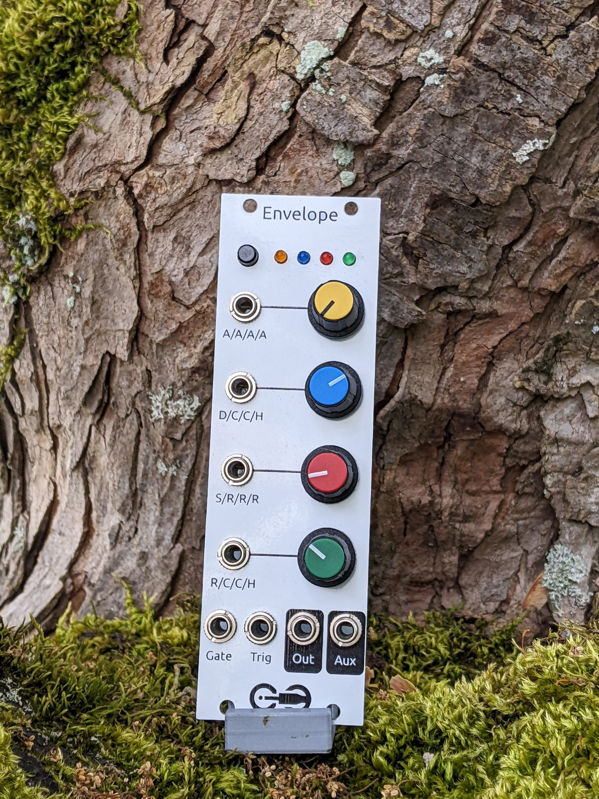
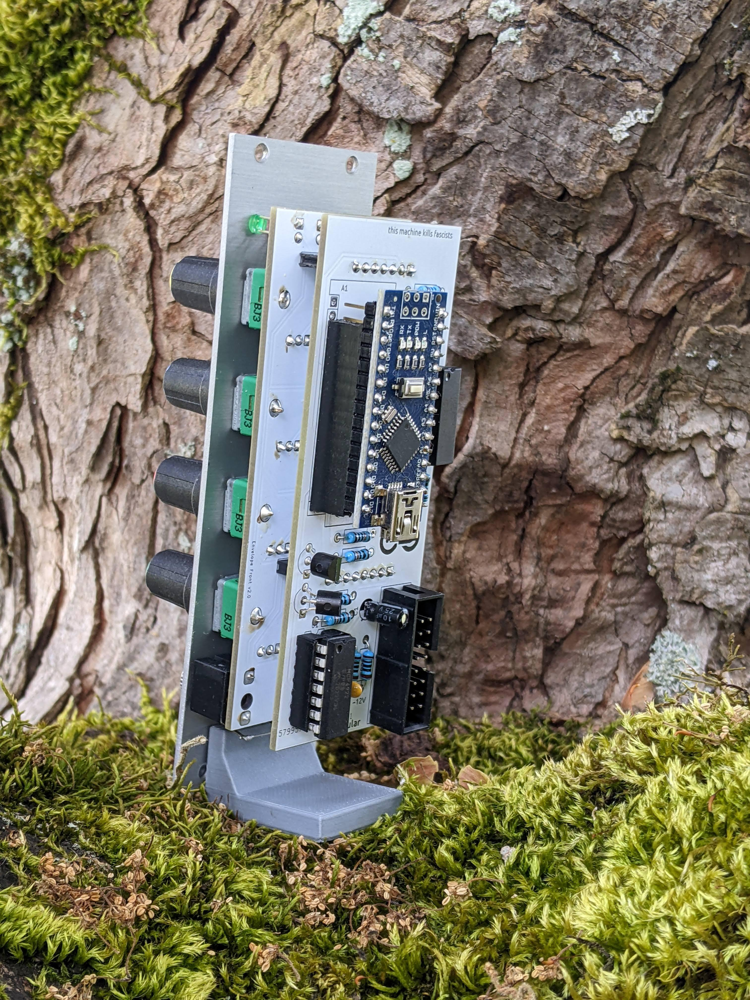

<h1>Envelope</h1>

A simple but powerful envelope generator that can cycle between 4 separate modes: traditional ADSR, AR with tunable curves, and two looping modes.

<h2>Resources</h2>

<ul>
  <li><a href="https://quinnfreedman.github.io/fm-artifacts/Envelope/envelope_manual.pdf">Manual</a></li>
  <li><a href="https://quinnfreedman.github.io/modular/modules/Envelope/docs/assembly_instructions">Assembly instructions and BOM</a></li>
  <li>Interactive BOM: <a href="https://quinnfreedman.github.io/fm-artifacts/Envelope/envelope_pcb_front_interactive_bom.html">front panel</a>, <a href="https://quinnfreedman.github.io/fm-artifacts/Envelope/envelope_pcb_back_interactive_bom.html">back panel</a></li>
  <li><a href="https://quinnfreedman.github.io/fm-artifacts/Envelope/envelope_faceplate.svg">Faceplate stencil SVG</a></li>
  <li>GERBER files:
    <ul>
      <li>Faceplate: <a href="https://quinnfreedman.github.io/fm-artifacts/Envelope/envelope_faceplate_jlcpcb.zip">JLCPCB</a>, <a href="https://quinnfreedman.github.io/fm-artifacts/Envelope/envelope_faceplate_pcbway.zip">PCBway</a></li>
      <li>Front panel: <a href="https://quinnfreedman.github.io/fm-artifacts/Envelope/envelope_pcb_front_jlcpcb.zip">JLCPCB</a>, <a href="https://quinnfreedman.github.io/fm-artifacts/Envelope/envelope_pcb_front_pcbway.zip">PCBway</a></li>
      <li>Back panel: <a href="https://quinnfreedman.github.io/fm-artifacts/Envelope/envelope_pcb_back_jlcpcb.zip">JLCPCB</a>, <a href="https://quinnfreedman.github.io/fm-artifacts/Envelope/envelope_pcb_back_pcbway.zip">PCBway</a></li>
    </ul>
  </li>
  <li>(Most) parts on Tayda: <a href="https://www.taydaelectronics.com/savecartpro/index/savenewquote/qid/36140668403">cart link</a>, <a href="https://freemodular.org/modules/Envelope/fm_envelope_tayda_bom.csv">quick-order CSV</a></li>
  <li><a href="https://quinnfreedman.github.io/fm-artifacts/Envelope/fm-envelope.hex">Firmware HEX</a></li>
  <li><a href="https://github.com/QuinnFreedman/modular/tree/main/modules/Envelope">Source code</a></li>
  <li><a href="https://quinnfreedman.github.io/fm-artifacts/Envelope/envelope_schematic.pdf">Schematic</a></li>
</ul>

<h2>Details</h2>

<b>DIY difficulty:</b> Easy (adding a flying ground buss to the bottom 4 jacks is slightly finicky) 
<b>HP:</b> 8 
<b>Power usage:</b>
<table class="fm-current-table">
  <tr>
    <th></th>
    <th>Typical</th>
    <th>Maximum</th>
  </tr>
  <tr>
    <td>+5V</td>
    <td>21mA</td>
    <td>28mA</td>
  </tr>
  <tr>
    <td>+12V</td>
    <td>NC</td>
    <td>-</td>
  </tr>
  <tr>
    <td>-12V</td>
    <td>NC</td>
    <td>-</td>
  </tr>
</table>

<a class="fm-etsy-link" href="https://www.etsy.com/listing/1788676580">
  
  <h3>Available on Etsy</h3>
  
You can buy PCBs, full kits, or hand-assembled modules directly from me on Etsy

</a>

