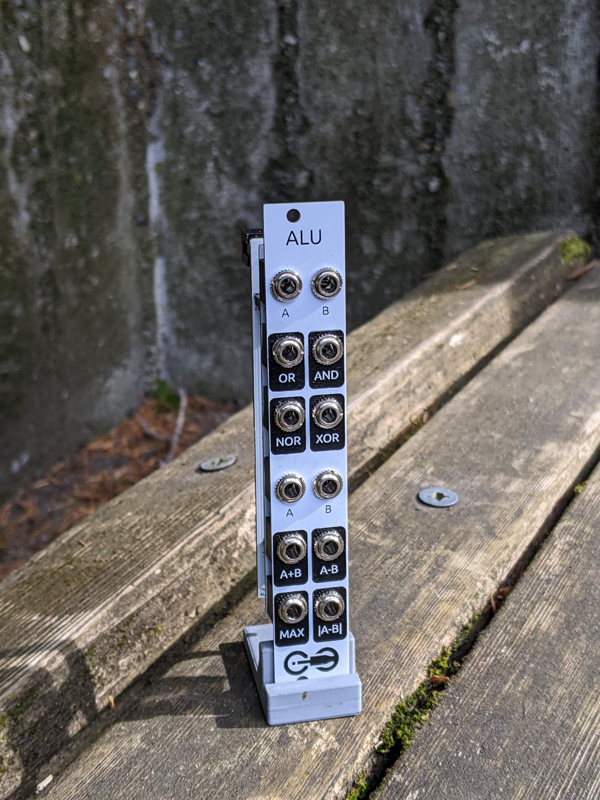
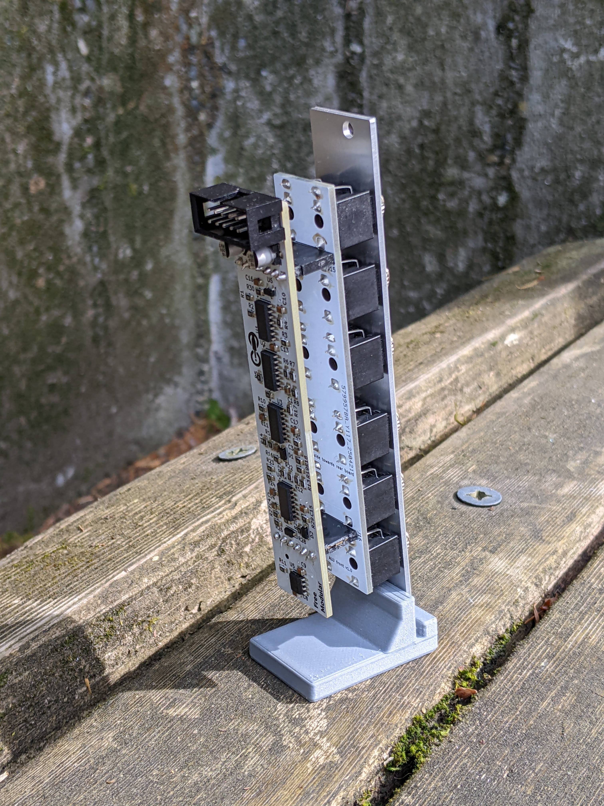

<h1>ALU</h1>

A multi-purpose utility module for performing various mathematical functions with voltage.

ALU (named for the <b>arithmetic logic unit</b> of a CPU) has two independent parts: a logic section capable of computing AND, OR, NOR, and XOR on two input gates, and an arithmetic section that can compute the sum, difference, maximum, and absolute value of two analog input signals.

<h2>Resources</h2>

<ul>
  <li><a href="https://quinnfreedman.github.io/fm-artifacts/Logic/logic_manual.pdf">Manual</a></li>
  <li><a href="https://quinnfreedman.github.io/modular/modules/Logic/docs/assembly_instructions">Assembly instructions and BOM</a></li>
  <li>Interactive BOM: <a href="https://quinnfreedman.github.io/fm-artifacts/Logic/logic_pcb_front_interactive_bom.html">front panel</a>, <a href="https://quinnfreedman.github.io/fm-artifacts/Logic/logic_pcb_back_interactive_bom.html">back panel</a></li>
  <li><a href="https://quinnfreedman.github.io/fm-artifacts/Logic/logic_faceplate.svg">Faceplate stencil SVG</a></li>
  <li>GERBER files:
    <ul>
      <li>Faceplate: <a href="https://quinnfreedman.github.io/fm-artifacts/Logic/logic_faceplate_jlcpcb.zip">JLCPCB</a>, <a href="https://quinnfreedman.github.io/fm-artifacts/Logic/logic_faceplate_pcbway.zip">PCBway</a></li>
      <li>Front panel: <a href="https://quinnfreedman.github.io/fm-artifacts/Logic/logic_pcb_front_jlcpcb.zip">JLCPCB</a>, <a href="https://quinnfreedman.github.io/fm-artifacts/Logic/logic_pcb_front_pcbway.zip">PCBway</a></li>
      <li>Back panel: <a href="https://quinnfreedman.github.io/fm-artifacts/Logic/logic_pcb_back_jlcpcb.zip">JLCPCB</a>, <a href="https://quinnfreedman.github.io/fm-artifacts/Logic/logic_pcb_back_pcbway.zip">PCBway</a></li>
    </ul>
  </li>
  <li><a href="https://github.com/QuinnFreedman/modular/tree/main/modules/Logic">Source files</a></li>
  <li><a href="https://quinnfreedman.github.io/fm-artifacts/Logic/logic_schematic.pdf">Schematic</a></li>
</ul>

<h2>Details</h2>

<b>DIY difficulty:</b> Hard (many surface mount components, but not too small) 
<b>HP:</b> 4 
<b>Power usage:</b>
<table class="fm-current-table">
  <tr>
    <th></th>
    <th>Typical current</th>
    <th>Maximum current</th>
  </tr>
  <tr>
    <td>+5V</td>
    <td>NC</td>
    <td>-</td>
  </tr>
  <tr>
    <td>+12V</td>
    <td>&lt;10mA</td>
    <td>20mA</td>
  </tr>
  <tr>
    <td>-12V</td>
    <td>&lt;10mA</td>
    <td>20mA</td>
  </tr>
</table>

<!--
<a class="fm-etsy-link" href="https://www.etsy.com/listing/___">
  
  <h3>Available on Etsy</h3>
  
You can buy PCBs, full kits, or hand-assembled modules directly from me on Etsy

</a>
-->

