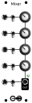

<h1>Mixer</h1>

A 5-input active mixer for audio or CV. Can be daisy-chained together for larger mixes.

<h2>Resources</h2>

<ul>
  <li><a href="https://quinnfreedman.github.io/fm-artifacts/Mixer/mixer_manual.pdf">Manual</a></li>
  <li><a href="https://quinnfreedman.github.io/modular/modules/Mixer/docs/assembly_instructions">Assembly instructions and BOM</a></li>
  <li><a href="https://quinnfreedman.github.io/fm-artifacts/Mixer/mixer_pcb_interactive_bom.html">Interactive BOM</a></li>
  <li><a href="https://quinnfreedman.github.io/fm-artifacts/Mixer/mixer_faceplate.svg">Faceplate stencil SVG</a></li>
  <li>GERBER files:
    <ul>
      <li>Faceplate: <a href="https://quinnfreedman.github.io/fm-artifacts/Mixer/mixer_faceplate_pcb_jlcpcb.zip">JLCPCB</a>, <a href="https://quinnfreedman.github.io/fm-artifacts/Mixer/mixer_faceplate_pcb_pcbway.zip">PCBway</a></li>
      <li>PCB: <a href="https://quinnfreedman.github.io/fm-artifacts/Mixer/mixer_pcb_jlcpcb.zip">JLCPCB</a>, <a href="https://quinnfreedman.github.io/fm-artifacts/Mixer/mixer_pcb_pcbway.zip">PCBway</a></li>
    </ul>
  </li>
  <li><a href="https://github.com/QuinnFreedman/modular/tree/main/modules/Mixer">Source files</a></li>
  <li><a href="https://quinnfreedman.github.io/fm-artifacts/Mixer/mixer_pcb_schematic.pdf">Schematic PDF</a></li>
</ul>

