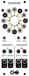
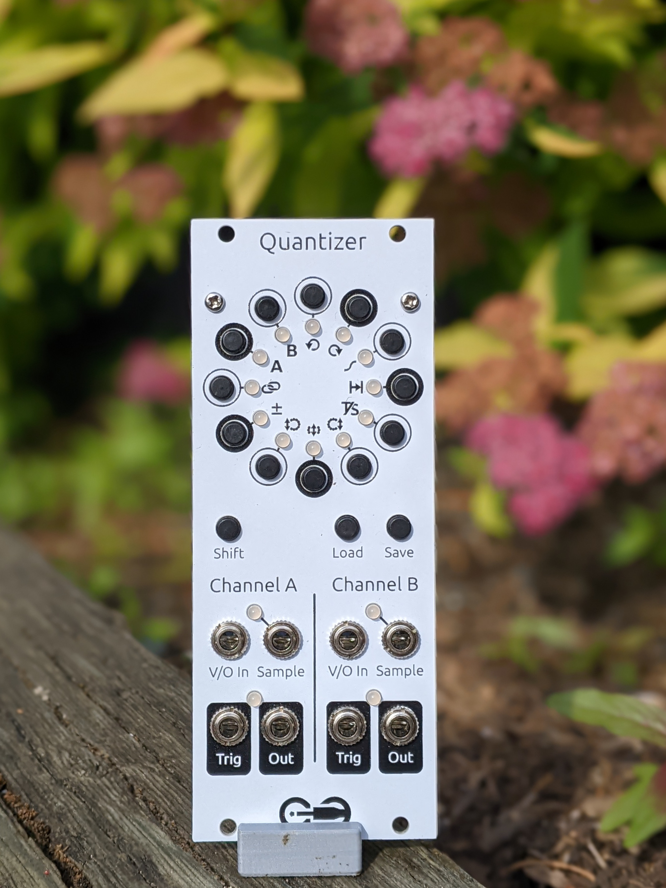
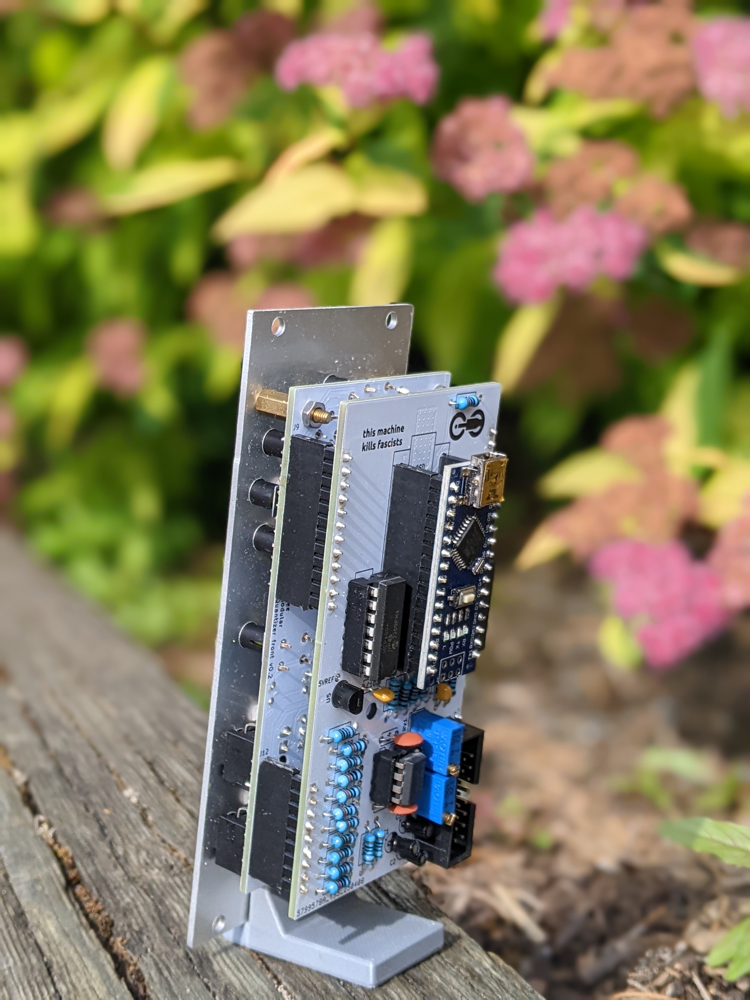

<h1>Quantizer</h1>

A 2-channel quantizer to round v/oct pitch signals to a musical scale.

The two channels can be totally independent or linked together. Each channel has adjustable transposition, delay, and portamento, with sample-and-hold, track-and-hold, or continuous quantization. Quantization scales can be set note-by-note, and also saved and recalled from persistent storage.

<h2>Resources</h2>

<ul>
  <li><a href="https://quinnfreedman.github.io/fm-artifacts/Quantizer/quantizer_manual.pdf">Manual</a></li>
  <li><a href="https://quinnfreedman.github.io/modular/modules/Quantizer/docs/assembly_instructions">Assembly instructions and BOM</a></li>
  <li>Interactive BOM: <a href="https://quinnfreedman.github.io/fm-artifacts/Quantizer/quantizer_front_pcb_interactive_bom.html">front panel</a>, <a href="https://quinnfreedman.github.io/fm-artifacts/Quantizer/quantizer_back_pcb_interactive_bom.html">back panel</a></li>
  <li><a href="https://quinnfreedman.github.io/fm-artifacts/Quantizer/quantizer_faceplate.svg">Faceplate stencil SVG</a></li>
  <li>GERBER files:
    <ul>
      <li>Faceplate: <a href="https://quinnfreedman.github.io/fm-artifacts/Quantizer/quantizer_faceplate_jlcpcb.zip">JLCPCB</a>, <a href="https://quinnfreedman.github.io/fm-artifacts/Quantizer/quantizer_faceplate_pcbway.zip">PCBway</a></li>
      <li>Front panel: <a href="https://quinnfreedman.github.io/fm-artifacts/Quantizer/quantizer_pcb_front_jlcpcb.zip">JLCPCB</a>, <a href="https://quinnfreedman.github.io/fm-artifacts/Quantizer/quantizer_pcb_front_pcbway.zip">PCBway</a></li>
      <li>Back panel: <a href="https://quinnfreedman.github.io/fm-artifacts/Quantizer/quantizer_pcb_back_jlcpcb.zip">JLCPCB</a>, <a href="https://quinnfreedman.github.io/fm-artifacts/Quantizer/quantizer_pcb_back_pcbway.zip">PCBway</a></li>
    </ul>
  </li>
  <li><a href="https://freemodular.org/modules/Quantizer/fm_quantizer_tayda_bom.csv">Tayda quick-order CSV</a> (incomplete)</li>
  <li><a href="https://quinnfreedman.github.io/fm-artifacts/Quantizer/fm-quantizer.hex">Firmware HEX</a></li>
  <li><a href="https://github.com/QuinnFreedman/modular/tree/main/modules/Quantizer">Source code</a></li>
  <li><a href="https://quinnfreedman.github.io/fm-artifacts/Quantizer/quantizer_schematic.pdf">Schematic</a></li>
</ul>

<h2>Details</h2>

<b>DIY difficulty:</b> Hard (One HTSSOP surface-mount part w/ ~.5mm pin pitch; everything else is easy) 
<b>HP:</b> 10 
<b>Power usage:</b>
<table class="fm-current-table">
  <tr>
    <th></th>
    <th>Maximum current</th>
  </tr>
  <tr>
    <td>+5V</td>
    <td>90mA</td>
  </tr>
  <tr>
    <td>+12V</td>
    <td>20mA</td>
  </tr>
  <tr>
    <td>-12V</td>
    <td>20mA</td>
  </tr>
</table>

<!--
<a class="fm-etsy-link" href="https://www.etsy.com/listing/___">
  
  <h3>Available on Etsy</h3>
  
You can buy PCBs, full kits, or hand-assembled modules directly from me on Etsy

</a>
-->

