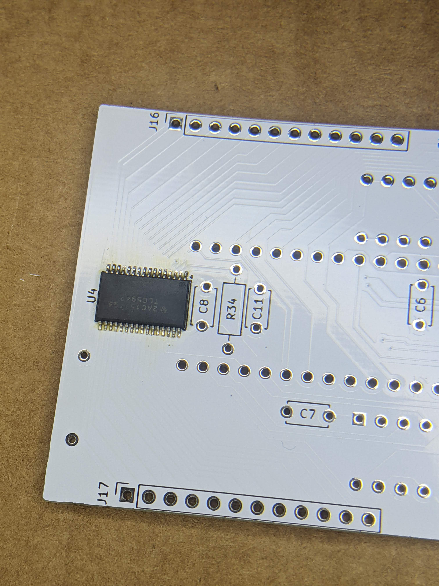
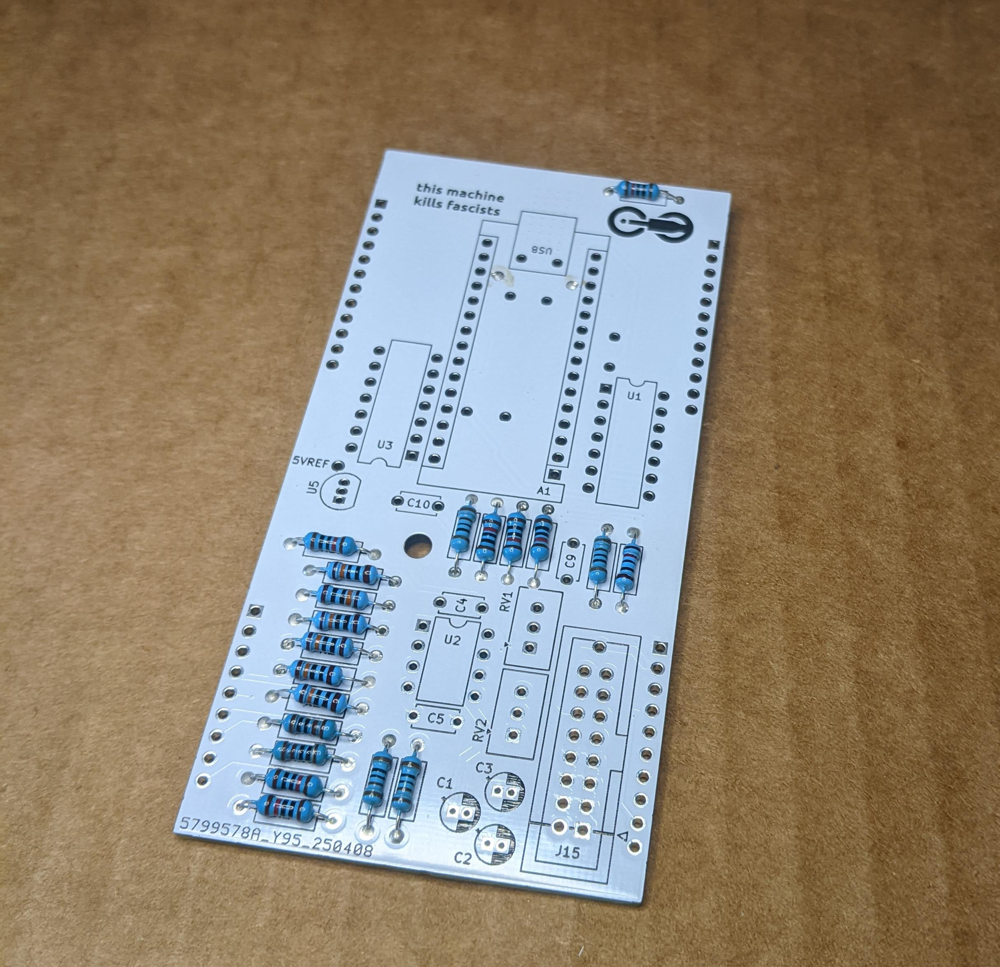
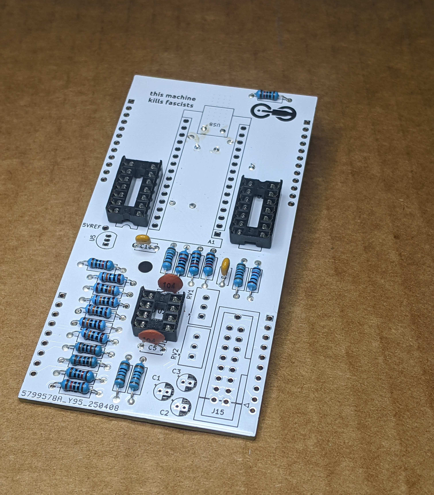
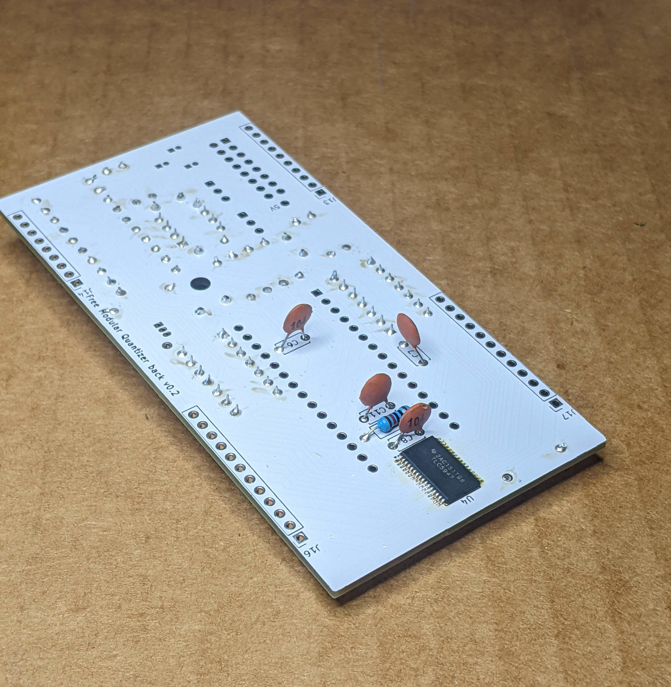
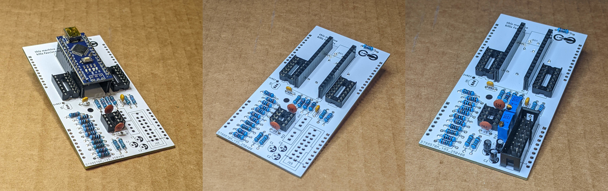
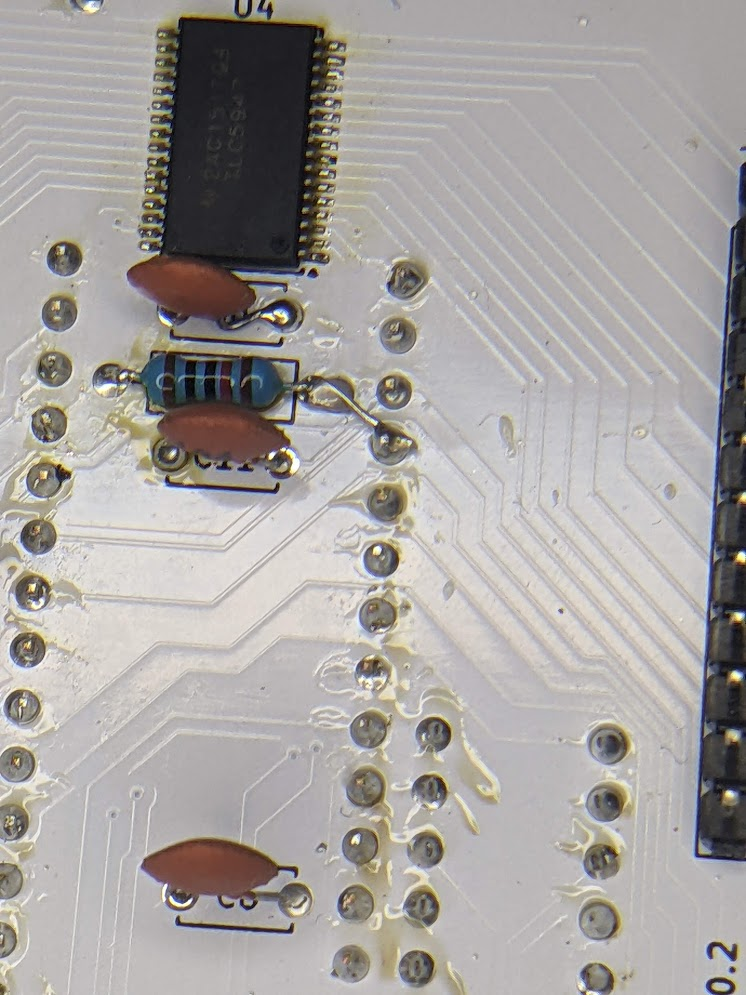
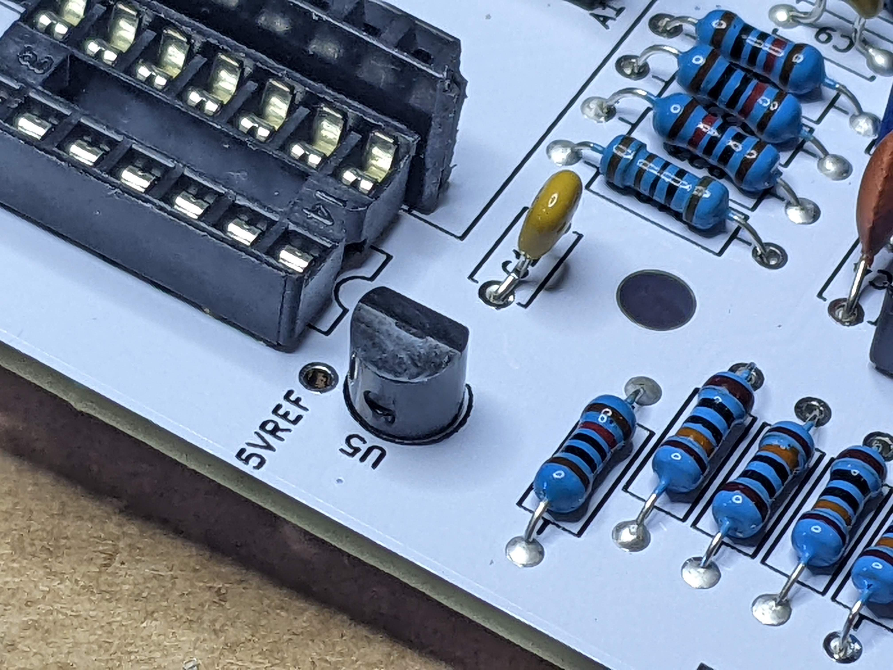
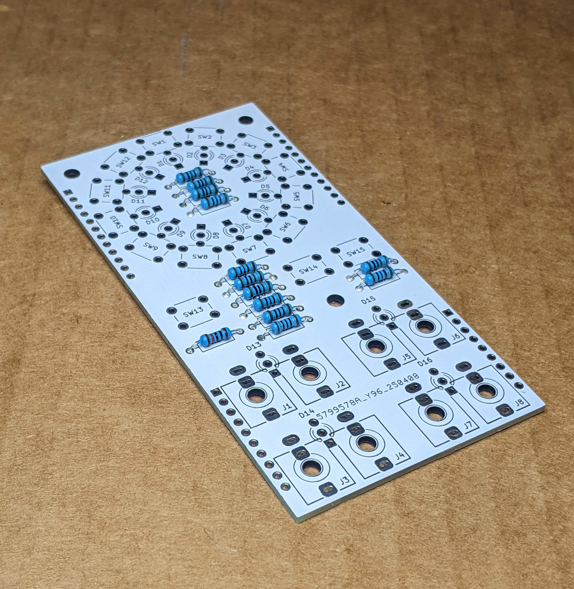
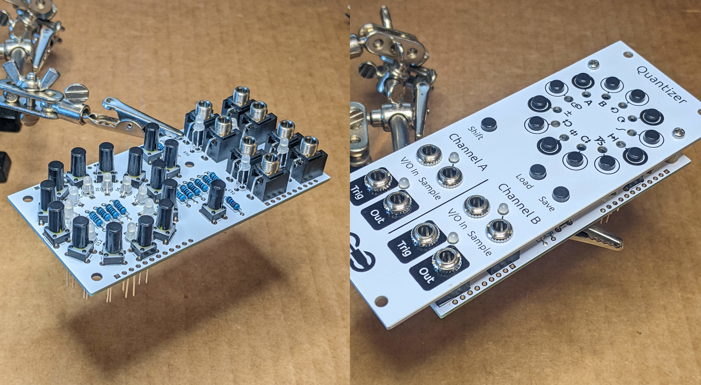
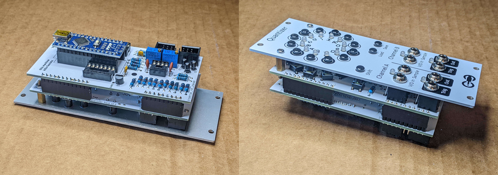

# Quantizer Assembly Instructions

## Components

**Most** parts are available on Tayda ([quick-order CSV](https://freemodular.org/modules/Quantizer/fm_quantizer_tayda_bom.csv)).

See [general components notes](https://quinnfreedman.github.io/modular/docs/components) for more info about sourcing parts.

Interactive BOM: [front](https://quinnfreedman.github.io/fm-artifacts/Quantizer/quantizer_pcb_front_interactive_bom.html), [back](https://quinnfreedman.github.io/fm-artifacts/Quantizer/quantizer_pcb_back_interactive_bom.html)

|    | Board | Reference                  | Part             | Value                                   | Source  | Comment |
| -- | ----- | -------------------------- | ---------------- | --------------------------------------- | ------- | ------- |
|    | Front | R1                         | Resistor         | 10kΩ                                    | [Tayda](https://www.taydaelectronics.com/resistors/1-4w-metal-film-resistors/10-x-resistor-10k-ohm-1-4w-1-metal-film-pkg-of-10.html) | |
|    | Front | R2-R13                     | Resistor         | 1kΩ                                     | [Tayda](https://www.taydaelectronics.com/10-x-resistor-1k-ohm-1-4w-1-metal-film-pkg-of-10.html) |  |
|    | Back  | R18-R19, R31, R32          | Resistor         | 1kΩ                                     |         | |
|    | Back  | R14-R17, R20-R23, R30, R33 | Resistor         | 10kΩ                                    |         | R20-R21 and R22-R23 are matched pairs. Ideally, they would be hand-picked to match each other or they would be lower-tolerance resistors. But, RV1 and RV2 optionally let you compensate for any mismatches. |
|    | Back  | R24-R29, R34               | Resistor         | 100kΩ                                   | [Tayda](https://www.taydaelectronics.com/resistors/1-4w-metal-film-resistors/10-x-resistor-100k-ohm-1-4w-1-metal-film-pkg-of-10.html) | R24-R25 and R26-R27 are also matched pairs, but they are less important since they only effect the input before quantization. |
|    | Back  | RV1, RV2                   | Potentiometer    | B1kΩ trim                               | [Tayda](https://www.taydaelectronics.com/potentiometer-variable-resistors/cermet-potentiometers/1k-ohm-trimmer-potentiometer-cermet-25-turns-3296w-jb.html) | **Optional.** These trim pots let you tune the output to compensate for any imperfections in the hardware. If you match R20-R21 and R22-R23 to each other, tuning shouldn't be necessary. If you don't want to bother with these, you can just short all three legs together for each potentiometer. Otherwise, you will have to adjust them by hand. |
|    | Back  | C1-C3                      | Capacitor        | 10uF                                    | [Tayda](https://www.taydaelectronics.com/10uf-16v-85c-radial-electrolytic-capacitor.html) | **Optional.** Power supply noise filtering capacitor |
|    | Back  | C4-C8, C11                 | Capacitor        | 100nF                                   | [Tayda](https://www.taydaelectronics.com/capacitors/ceramic-disc-capacitors/a-553-0-1uf-50v-ceramic-disc-capacitor-pkg-of-10.html) | **Optional.** Power filtering and decoupling |
|    | Back  | C9, C10                    | Capacitor        | 100pF                                   | [Tayda](https://www.taydaelectronics.com/10-x-100pf-50v-ceramic-disc-capacitor-pkg-of-10.html) | **Optional.** Amp stabilizing caps |
|    | Front | J1-J8                      | 3.5mm Jack       | THONKICONN (a.k.a PJ398SM or PJ301M-12) | [Tayda](https://www.taydaelectronics.com/pj-3001f-3-5-mm-mono-phone-jack.html) | |
|    | Both  | J9-J14, J16-J17            | Pin headers      | 1x12, 1x12, 1x9, 1x10                   | Tayda ([Male](https://www.taydaelectronics.com/40-pin-2-54-mm-single-row-pin-header-strip.html), [Female](https://www.taydaelectronics.com/40-pin-2-54-mm-single-row-female-pin-header.html)), [Amazon](https://www.amazon.com/gp/product/B074HVBTZ4) | Cut headers down to size. Solder the two boards directly together using the male headers or make them detachable using a male/female pair. |
|    | Back  | J15                        | IDC connector    | 2x8                                     | [Tayda](https://www.taydaelectronics.com/16-pin-box-header-connector-2-54mm.html) | Eurorack power header |
| 🔴 | Front | D1-D16                     | LED              | 3mm red-green bi-color common anode     | [Amazon](https://www.amazon.com/EDGELEC-Bi-Color-Diffused-Resistors-Included/dp/B077XG5NSC) | Make sure to get 3-pin bi-color LEDs with a shared (common) anode in a KAK-configuration (anode in the middle). When assembling, orient the LEDs so that the **red** cathode is in the **square hole**. In the LEDs I have seen, this means orienting them "normally" so that the flat edge of the bulb is aligned with the square pad, but red and green may be reversed on your LEDs. It may be worth double-checking your LEDs on a breadboard first. |
|    | Back  | A1                         | Arduino Nano     | v3.0                                    | [Tayda](https://www.taydaelectronics.com/type-c-nano-3-0-controller-compatible-with-arduino-nano.html) | |
| 🔴 | Back  | U1                         | DAC              | MCP4922-E/P                             | [DigiKey](https://www.digikey.com/en/products/detail/microchip-technology/MCP4922-E-P/716251), [Mouser](https://mou.sr/4cwtePf) | |
|    | Back  | U2                         | Op-amp           | TL072                                   | [Tayda](https://www.taydaelectronics.com/tl072-low-noise-j-fet-dual-op-amp-ic.html) | TL082 is probably fine too |
|    | Back  | U3                         | Op-amp           | MCP6004                                 | [Tayda](https://www.taydaelectronics.com/mcp6004-single-supply-cmos-ic.html) | |
| 🔴 | Back  | U4                         | LED driver       | TLC5947DAP                              | [Mouser](https://www.mouser.com/ProductDetail/595-TLC5947DAP) | This is the only surface mount part. It is relatively small (HTSSOP). |
| 🔴 | Back  | U5                         | Voltage Regulator| LM4040*IZ-5                             | [DigiKey](https://www.digikey.com/en/products/detail/texas-instruments/LM4040DIZ-5-0-NOPB/212719), [Mouser](https://www.mouser.com/c/semiconductors/power-management-ics/voltage-references/?q=lm4040&mounting%20style=Through%20Hole&output%20voltage=5%20V) | This is used as a reference voltage for digital <> analog conversions. If you don't care as much about accuracy or if you have a very stable 5V power rail, you can leave this out and use the 5V power rail as the reference voltage. If you do, just jump the hole labelled "5V" to the hole labelled "5VREF". In that case, leave out R33. This chip comes in "A" through "E" skews that correspond to different tolerances (and costs). |
| 🔴 | Front | SW1-SW15                   | Button           | TL1105SP (e.g. TL1105SPF250Q) + 1RBLK   | [DigiKey (switch)](https://www.digikey.com/en/products/detail/e-switch/TL1105SPF250Q/271559), [DigiKey (cap)](https://www.digikey.com/en/products/detail/e-switch/1RBLK/271579) | The caps for these switches need to be purchased separately. The caps I use are `#1RBLK`. The switches are available in different actuation forces and materials, so the last part of the part number might be a little different. Sometimes, the switches and caps will be sold together and the cap number is appended to the end of the part number. If you don't want to use these specific switches, any "6mm tactile switch" with a standard 4.5mm x 6.5mm mounting pattern like [this one](https://www.taydaelectronics.com/tact-switch-6-6mm-13mm-through-hole-spst-no.html) should work here. Those are a bit narrower, though, so you might want to adjust the faceplate accordingly. |
| 🔴 | Both  | -                          | Mounting screw   | 2 M3x10mm standoff, 1 M3x11mm standoff or bolt |  | Two standoffs hold the front PCB to the faceplate, since the buttons don't attach to the faceplate. Optionally, you can also use one more standoff or bolt to hold the two PCBs together. |

🔴 = Missing from Tayda BOM

## Build Guide

Start by soldering the TLC5947DAP. The pins are quite fine and it is very easy to accidentally short together or not connect fully. Double check that it is connected correctly before continuing.

Starting on the rear board, add the resistors. Refer the interactive BOM to see which values go where.

Add the IC sockets and small capacitors.

Flip the board over and add the resistor and capacitors on the back side.

Attach the Arduino using female pin headers, then remove it to make it easier to add the power header and electrolytic capacitors. Optionally, you can add the two trim pots for tuning. If you don't want to bother with fine-tuning, just short all three holes for each trim pot together using a cut off leg of a resistor.

If you have version `v0.2` of the rear PCB, you also need to bridge the right leg of R34 to the 4th pin down on the back of the Arduino, as shown. After the jumper is added, the left leg of R34 should be connected directly to +5V and the right leg should be connected to the A0 pin of the Arduino. Use a cutoff leg of one of the resistors and just hook it around R34 with a dab of solder. If you have version 1.0 of the PCB, you can ignore this step.

Optionally, add the 5V regulator. This is used as a precision reference voltage to make sure the output of the module is accurate. If you don't want to use it, you can just use the 5V power rail instead. Just connect the pad labelled "5V" to the one labelled "5VREF" using som insulated wire.

On the front PCB, add in the resistors just as on the rear board.

Put in all the interface components. Double-check the orientation of the LEDs. The red cathode goes in the square hole. The bulbs of the bottom LEDs will sit slightly on top of the jack sockets. Bolt down the faceplate using the 10-mm standoffs and tighten everything in place before soldering.

Solder the two boards together using pin headers. You can take the faceplate back off if it makes it easier to reach. Then put the ICs and the Arduino back in their sockets.

Lastly, [upload the firmware](https://freemodular.org/docs/assembly#firmware).

## Tuning

Tuning is probably not necessary since the oscillator you are driving with this module likely already has less precise tracking than the quantizer. But, if you want to fine-tune the output scale, you can use the trim pots on the back. Plug in the module and power it on. Enable the top note (C) and send a known integer voltage <10V into the V/O input of channel 1. 5V works well. It doesn't have to be exact, since the module will round it. Then hook up a multimeter in Volts DC mode to the output of channel 1. Use a screwdriver to adjust the top potentiometer on the back of the module until the reading is exactly 5V (or whatever voltage you are expecting). Then do the same with the other potentiometer for channel 2.

The trim potentiometers allow you to dial in the 1 Volt / octave rate. If you want to shift the whole scale up or down (i.e. set the "zero" note), just use the pre- and/or post-shift setting on each channel, or tune your oscillator.
