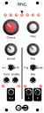

<h1>RNG</h1>

If you want to make any kind of generative music, you probably want some source of randomness to keep the sound fresh and evolving. But, pure random noise can sound too chaotic and unmusical.

The RNG (Random Number Generator) solves this problem. It keeps a buffer of CV values that it steps through in a loop. But, every time it outputs a value, it has a change to replace that value with a new random one.

This module is clearly inspired by the MTM Turing Machine, but it works differently. Using a digital instead of all-hardware design allows the RNG to be more flexible with more buffer lengths and a discrete analog value for each step instead of constructing the value out of shift registers.

<h2>Resources</h2>

<ul>
  <li><a href="https://quinnfreedman.github.io/fm-artifacts/RNG/rng_manual.pdf">Manual</a></li>
  <li><a href="https://quinnfreedman.github.io/modular/modules/RNG/docs/assembly_instructions">Assembly instructions and BOM</a></li>
  <li>Interactive BOM: <a href="https://quinnfreedman.github.io/fm-artifacts/RNG/rng_pcb_front_interactive_bom.html">front panel</a>, <a href="https://quinnfreedman.github.io/fm-artifacts/RNG/rng_pcb_back_interactive_bom.html">back panel</a></li>
  <li><a href="https://quinnfreedman.github.io/fm-artifacts/RNG/rng_faceplate.svg">Faceplate stencil SVG</a></li>
  <li>GERBER files:
    <ul>
      <li>Faceplate: <a href="https://quinnfreedman.github.io/fm-artifacts/RNG/rng_faceplate_pcb_jlcpcb.zip">JLCPCB</a>, <a href="https://quinnfreedman.github.io/fm-artifacts/RNG/rng_faceplate_pcb_pcbway.zip">PCBway</a></li>
      <li>Front panel: <a href="https://quinnfreedman.github.io/fm-artifacts/RNG/rng_pcb_front_jlcpcb.zip">JLCPCB</a>, <a href="https://quinnfreedman.github.io/fm-artifacts/RNG/rng_pcb_front_pcbway.zip">PCBway</a></li>
      <li>Back panel: <a href="https://quinnfreedman.github.io/fm-artifacts/RNG/rng_pcb_back_jlcpcb.zip">JLCPCB</a>, <a href="https://quinnfreedman.github.io/fm-artifacts/RNG/rng_pcb_back_pcbway.zip">PCBway</a></li>
    </ul>
  </li>
  <li>(Most) parts on Tayda: <a href="https://www.taydaelectronics.com/savecartpro/index/savenewquote/qid/02840666568">cart link</a>, <a href="https://freemodular.org/modules/RNG/fm_rng_tayda_bom.csv">quick-order CSV</a></li>
  <li><a href="https://quinnfreedman.github.io/fm-artifacts/RNG/fm-rng.hex">Firmware HEX</a></li>
  <li><a href="https://github.com/QuinnFreedman/modular/tree/main/modules/RNG">Source code</a></li>
  <li>Schematic: <a href="https://quinnfreedman.github.io/fm-artifacts/RNG/rng_pcb_front_schematic.pdf">front panel</a>, <a href="https://quinnfreedman.github.io/fm-artifacts/RNG/rng_pcb_back_schematic.pdf">back panel</a></li>
</ul>

<b>HP:</b> 10 
<b>Power usage:</b>
<table class="fm-current-table">
  <tr>
    <th></th>
    <th>Typical</th>
    <th>Maximum</th>
  </tr>
  <tr>
    <td>+5V</td>
    <td>28mA</td>
    <td>33mA</td>
  </tr>
  <tr>
    <td>+12V</td>
    <td>4mA</td>
    <td>8mA</td>
  </tr>
  <tr>
    <td>-12V</td>
    <td>4mA</td>
    <td>8mA</td>
  </tr>
</table>

