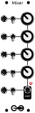

# Mixer

A simple 5-channel mixer for audio or CV.

## Manual

The top 4 channels are passed to the mixer via a mute switch and an attenuator knob. The 5th channel has a mute switch but no volume knob.

The volume knobs go from basically 0v (totally off) to nearly 100% volume (this mixer cannot provide any gain boost). In reality, the inputs are not buffered before they are attenuated so the volume may depend very slightly on the output impedance of the modules feeding into the mixer. Also, some potentiometers can't actually go all the way to zero so if you want the sound to be completely muted just use the switch, which will totally disconnect the signal.

The output *is* buffered, so this is an active (not passive) mixer.

Based on the [1163 Mini Mixer](https://www.lookmumnocomputer.com/projects#/1163-mini-mixer) by Look Mum No Computer.

### Daisy Chaining

Any number of mixer modules can be daisy chained together using the "chain in" and "chain out" connectors on the back. Make sure to keep the orentation (i.e. connect the top output to the top input and the bottom to the bottom). When chained together, the normalled output of one mixer is treated as a 6th input to the other. This means that when no patch cable is connected to the output of the first mixer, it's output is routed to the next mixer. When a jack is plugged into the output of the first mixer, it is removed from the seccond mix.

## Assembly 

### Components

See [components page](https://github.com/QuinnFreedman/modular/wiki/Components) for more info.

| Reference | Part           | Value        | Comment |
|-----------|----------------|--------------|--|
| R1-R9     | Resitor        | 100kΩ        | Any value is fine for these, as long as they are all the same. *Technically* R6 should be 99kΩ, but the difference wouldn't be noticable. |
| R10       | Resitor        | 1kΩ          | Output Impedence |
| R11       | Resitor        | 470Ω         | This controlls the LED brightness. Higher resistance value will make the LED dimmer. You might want to experement with a wide range of values up to 10k to dial in the right brightness for your LEDs. |
| RV1-RV4   | Potentiometer  | B100kΩ       | Any value should work for these |
| J1-J6     | Jack Socket    | PJ301M-12    |  |
| J7        | Power header   | IDC male 2x8 |  |
| J8, J9    | Jumper headers |              | **(Optional)** Chain multiple modules together by connecting OUT to IN. |
| U1        | Op-amp         | TL072        |  |
| D1        | LED            | 3mm          | Optionally, you could use a bi-directional LED here. Using a normal LED as shown in the design, with anode on top, will only illuminate when the mixer is outputting a positive voltage. |
| C1, C2    | Capacitor      | 100nf        | **(Optional)** Power filtering |
| C3, C4    | Capacitor      | 100nf        | **(Optional)** Amp stabilization |
| C5, C6    | Capacitor      | 10uf         | **(Optional)** Power filtering |

### Instructions

See [general assembly instructions](https://github.com/QuinnFreedman/modular/wiki/Assembly).
