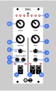

# RNG

RNG stands for Random Number Generator. The ability to generate random control voltages is essential to creating generative music. However, purely random values can be noisy and chaotic. RNG lets you blend between looping old values and mutating them into new, random ones in a probabalistic way. It is inspired by Music Thing Modular's [Turing Machine](https://musicthing.co.uk/pages/turing.html) but with a lot of added functionality. In addition to outputting stepped random and/or looping values, RNG lets you blend between two channels of triggers/gates based on those values.

### Example uses

* Random melodies: Set Chaos to a low value and set the length to a small power of 2. Then, patch the output into a quantizer and use it as a pitch CV to generate looping but randomly generating melodies, synced with a clock.
* Drum multiplexer: Plug a drum trigger into Clock and patch A and B to trigger two different drum sounds. Then, when a drum trigger comes in it will be randomly sent to one channel or the other. This can be totally random or looping.
* Probabilistic sequencer: same as above but leave one output unconnected. This allows a sequencer without built in probability functionality to have some randomness.
* Random clock divider: Patch a steady clock into **Clock** and patch **B** out as the new clock with a high bias. This way, the clock pulses will occasionally not register, allowing two sequences to fall out of phase for syncopated polyrythms.
* Hook multiple RNGs together. Use the probabilistic clock from one of them to advance a random CV sequence from the other.

## Manual

**(A) LEDs**. A row of LEDs across the top show the current sequence being played. Brighter LEDs correspond to higher values. The middle LED is the value currently being played.

**(B) Chaos**: Controls how much randomness in injected into the sequence. At zero (all the way left) the sequence is locked in a loop and no randomness is added. All the way to the right, each value played is completely random. In the middle, values will be played from the saved loop but with a chance of mutating each time they are played.

**(C) Length**: A rotary encoder that allows you to control the length of the sequence. When you turn the knob, the length of the sequence will be displayed in binary on the top row of LEDs. Hold the knob down to quickly skip between powers of twos. If set to a negative number (indicated with a HIGH value on the far left bit) then the sequence will "yoyo," playing alternatingly forward and backward.

### Left Side

Stepped voltage mode. This half of the module outputs a stepped random voltage 

**(D) Range**: The range/spread of the random voltages output. This is a digital scaling that is applied before the signal is output. This means that theoretically if you turned the range way down and then boosted it way back up with a VCA, you could get some digital artifacts. But, it also means that via firmware updates this could be reconfigured to effect the range or distribution of new values that are created instead of scaling the output.

**(E) Bi/unipolar**: Determines whether the values are unipolar (0 to +10v) or bipolar (-10v to +10v)

**(F) Clock** (input): Whenever HIGH, the values are advanced by one, a new value from the loop is played (and maybe mutated).

**(G) CV** (input): Control voltage to control the Chaos parameter. There are two configurable modes. It can either act as a direct CV (i.e. higher values = more randomness) or as a lock gate so it has no effect when LOW and then locks the sequence in place and prevents any mutation when HIGH.

**(H) Out** (output): Stepped random voltage output.

### Right Side

Binary choice mode. This side of the module randomly chooses between two output trigger/gates based on the value of the left side.

**(I) Bias**: The probability of outputting to channel A vs B. In practice, this input is interpreted as a threshold value. Whenever an output would be generated that is above the threshold, channel A is triggered. When it is below, channel B is triggered.

**(J) Trigger/Gate**: Chooses whether the A/B outputs should be triggers (a short voltage spike with every new clock pulse) or gates (remain steadily high until the output channel is changed). THe duration of the triggers is configurable in the firmware.

**(K) Bias** (input): Addative CV control for the Bias knob

**(L/M) A** & **B** (output): Two channels of gate/trigger output. A corresponding LED lights up when each gate is open.

## Assembly

See [general assembly instructions](https://github.com/QuinnFreedman/modular/wiki/Assembly).

### Components

See [components page](https://github.com/QuinnFreedman/modular/wiki/Components) for more info.

| Reference | PCB   | Part           | Value      | Comment |
|-----------|-------|----------------|------------|--|
| R1,R2     | Front | Resistor       | 100kΩ      |  |
| R3,R4     | Front | Resistor       | 1kΩ        |  |
| R5-R8     | Front | Resistor       | ~1kΩ       | These resistors control the brightness of the four bottom LEDs. Their value might depend on which LEDs you use. Increasing their value will decrease the brightness. |
| R9,R11-R13,R16| Back  | Resistor       | 100kΩ      |  |
| R10       | Back  | Resistor       | ~1kΩ       | This resistor controls the brightness of all 7 top LEDs. Higher value = dimmer light |
| R14,R15   | Back  | Resistor       | 50kΩ       |  |
| R17       | Back  | Resistor       | 470Ω       |  |
| RV1-RV3   | Front | Potentiometer  | 50kΩ Linear| The value of these potentiometers doesn't really matter. `R14` and `R2` just need to be scaled to match `RV2`. So, for example, if `RV2` is 100kΩ, then `R2` should be 200kΩ and `R14` should be 100kΩ. |
| SW1       | Front | Rotary Encoder | CTY1100 or similar |  |
| SW2,SW3   | Front | Switch         | TAIWAY 200CWMSP1T3B4M2 | Any SPDT switch would work here. I use [TAIWAY 200-series](https://www.taiway.com/resource/annexes/product_items/74/856052d1ea82867d7e77babb534d1633.pdf) "sub-miniature" switches because they fit behind the faceplate. The pin pitch on the PCB is 0.1in.|
| D1-D11    | Front | LED            | 3mm        |  |
| J1-J6     | Front | Jack           | PJ301M-12  |  |
| J7-J10    | Both  | Stacking pin headers | 1x6, 1x7, 1x8, 2x3 | Cut headers to size. You can just use two rows of headers for the 2x3. You can get matching male/female pairs for a detachable connection (recommended) or just use male headers for a soldered connection. |
| J11       | Back  | Power connector| IDC male 2x8 shrouded | Or, use two rows of male pin headers |
| C1-C4     | Back  | Capacitor      | 100nF      | C2-C4 are optional noise-reducing bypass capacitors |
| C5-C7     | Back  | Capacitor      | 10uF       | Optional noise-reduction |
| U1        | Back  | LED controller | TLC5940NT  |  |
| U2        | Back  | DAC            | MCP4922    |  |
| U3        | Back  | Op-amp         | MCP6002    |  |
| U4        | Back  | Op-amp         | TL074      |  |
| U5        | Back  | Voltage regulator | LM4040BCZ-5 (5v) |  |
| A1        | Back  | Arduino nano   | v3.0       |  |

## Requirements

Arduino IDE 1.8.10 

|Library                | Author          | Version |
|-----------------------|-----------------|---------|
| [SPI][1]              | Arduino         |         |
| [TLC5940][2]          | Paul Stoffregen | 1.1.1   |

[1]: https://www.arduino.cc/en/reference/SPI
[2]: https://github.com/PaulStoffregen/Tlc5940 
