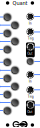
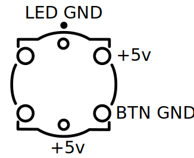

# Quantizer

A quantizer rounds continuous voltage into a number of discrete values. This can be used to convert random CV (like from [LFO](https://github.com/QuinnFreedman/modular/tree/master/Simplex#lfo-mode), [Simplex](https://github.com/QuinnFreedman/modular/tree/master/Simplex), or [RNG](https://github.com/QuinnFreedman/modular/tree/master/RNG)) into musical tones in a given scale. This module offers two channels of quantization to the same scale, with input or output triggers on note change.

## Manual

### (A) Input

Volt/oct input for channel 1.

### (B) Trigger

Trigger for channel 1. This can be an input or an output depending on the mode selected. When in output mode, A short trigger will be sent here every time the output note for this channel changes. When in input mode, the quantizer will behave like a sample-and-hold, only checking the input voltage when it recieves a pulse to this input.

### (C) Output

Quantized v/oct output for channel 1.

### (D) Menu Button

When holding the menu button, the function of all of the LED buttons changes.

### (E), (F), (G)

Same as A, B, C, for channel 2.

### LED buttons (1-12)

These buttons represent the notes of a 12-tone equal temperament scale. They will illuminate dimly to indicate that the given note is selected as part of the current scale, and will be illuminated brightly to indicate that the note is currently being played. Pressing the buttons will toggle the note on or off. Each button has a different function when the Menu button (D) is being held.

### (1), (2)

Switch between input and output mode for the triggers of channels 1 and 2 respectively.

### (3), (4)

Transpose up, down. Move the whole scale one note up **(3)** or down **(4)**.

### 5-8

Preset scales. Pressing these buttons while holding the Menu button will load the given scale.

* **5**: Chromatic
* **6**: Major/Minor
* **7**: Pentatonic Major/Minor
* **8**: Major triad

**Why are major and minor the same button?** The only difference between a major scale and its relative minor is the root note. The scales include the same notes. The idea of a root note doesn't really make sense for a quantizer. The quantizer only cares about which notes are let through. There aren't enough buttons to be able to select any individual major or minor scale, so you just need to pick the overall type of scale with buttons 5-8 and then transpose it up/down with buttons 3-4 to get the exact scale you want.
 
### 8-12

User defined scales. Short-pressing these buttons while holding the Menu button will load the corresponding user scale. Long-pressing (while holding the Menu button the whole time) will store the current scalue in the given slot.

## Assembly

### Components

See [general assembly instructions](https://github.com/QuinnFreedman/modular/wiki/Components) for more info.

* Resistors
    * 14 1kohm
    * 12 10kohm
    * 4 20kohm
    * 4 100kohm
    * 1 2kohm (controlls LED current -- 1k or 10k is fine)
* 1 small button
* 12 LED light-up buttons (or 12 buttons and 12 separate LEDs)
* 2 PNP transistors
* 1 TL072
* 1 TL074
* 1 MCP4922
* 1 TLC5940NT
* Arduino Nano v3
* Stacking headers and 2x8 shrouded header

<table>
 <tr>
  <th>Refference</th>
  <th>Value</th>
  <th>Comment</th>
 </tr>
 <tr>
  <td>R1-R12 (front)</td>
  <td>1kΩ</td>
  <td>Can be any value as long as they all match each other</td>
 </tr>
 <tr>
  <td>R1-R4 (back)</td>
  <td>10kΩ</td>
  <td></td>
 </tr>
 <tr>
  <td>R5, R6 (back)</td>
  <td>10kΩ</td>
  <td></td>
 </tr>
 <tr>
  <td>R7, R8, R10, R11 (back)</td>
  <td>100kΩ</td>
  <td></td>
 </tr>
 <tr>
  <td>R9, R12 (back)</td>
  <td>1kΩ</td>
  <td></td>
 </tr>
 <tr>
  <td>R14-R23</td>
  <td>10kΩ</td>
  <td>Can be any value, as long as they match each other. These control the output signal amplification so you will get a more accurate tuning if you match these resistors exactly.</td>
 </tr>
 <tr>
  <td>S1-S12</td>
  <td>TL1265 LED illuminated push button</td>
  <td>These are surprisingly expensive and hard to find. If you can't find any LED buttons that will fit in the PCB, you could use panel mount buttons and solder a 3-wire connector here instead. These buttons need to bridge +5v to the button ground and the LEDs should connect 5v to the led ground (see image).  </td>
 </tr>
 <tr>
  <td>S13</td>
  <td>Button</td>
  <td>You can use any panel-mount OFF-(ON) style push button here as long as it fits. There is an 8mm hole in the PCB for the back side of the button to extend through. The two pins of the button will need to be soldered two the two holes marked "S13" via a bit on insulated wire. It does not matter which lead of the button connects to which hole as long as the button will connect the two points together when pressed.</td>
 </tr>
</table>

### Jack sockets

The bottom most jack socket hangs slightly off the PCB. You can just connect the hanging leg to the hole labelled "GND" with a wire, or make the PCB slightly larger if you don't mind paying a higher rate.
